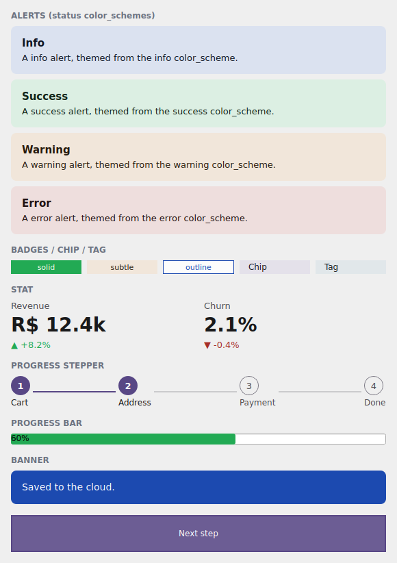

# Data display e feedback

Você já tem ação ([variantes](variantes.md), [kit](kit.md)) e moldura
([superfície](superficie.md)). Falta **conversar com o usuário**: avisar que algo
deu certo, alertar de um erro, mostrar uma métrica, indicar o progresso. Esta
página fecha o design system com a camada de *data display* + *feedback* — e
introduz os `color_scheme`s de **status**.

{ width=300 }

*O exemplo `examples/h4gallery` no simulador Qt: alertas de status, a família de
badges, `Stat`, `ProgressStepper`, `ProgressBar` e um `Banner`.*

!!! info "Onde os nomes moram"
    Tudo desta página é importado de **`tempestroid`**: os widgets (`Alert`,
    `Banner`, `Badge`, `Chip`, `Tag`, `Stat`, `ProgressStepper`, `ProgressBar`),
    os enums `AlertVariant`/`BadgeVariant` e o `Theme`/`Color`.

## Os `color_scheme`s de status

Até aqui você viu os papéis de ênfase: `primary`, `secondary`, `tertiary`,
`error` e `neutral`. O design system adiciona **três papéis de status** de
primeira classe — famílias tonais M3 completas, com seus pares `on_*` gerados
para contraste WCAG-AA:

| `color_scheme` | Significa | Uso típico |
|---|---|---|
| `"success"` | deu certo | confirmação, salvo, válido |
| `"warning"` | atenção | aviso reversível, limite próximo |
| `"info"` | informação | dica neutra, novidade |

Eles entram em **qualquer** componente que aceite `color_scheme` — exatamente
como os papéis de ênfase. Junto com `"error"`, são o vocabulário de feedback.

!!! check "Cor + container, ambos AA"
    Cada papel de status carrega o par base/`on_*` **e** uma variante de
    *container* (fundo tonal claro + conteúdo escuro) que as variantes `SUBTLE`
    usam. Os dois pares são gerados para atingir contraste WCAG-AA no claro e no
    escuro — você escolhe o status, o motor garante a legibilidade.

## `Alert` e `Banner`

Um `Alert` é a caixa de mensagem inline; um `Banner` é a faixa larga (topo de
tela). Os dois carregam `color_scheme` (o status) e `variant` (enum
`AlertVariant`) para o tratamento visual:

| `AlertVariant` | Tratamento |
|---|---|
| `SUBTLE` | fundo tonal *container* + conteúdo escuro (o padrão) |
| `SOLID` | fundo no papel cheio + conteúdo `on_*` |
| `LEFT_ACCENT` | barra de acento à esquerda, fundo suave |
| `TOP_ACCENT` | barra de acento no topo, fundo suave |

```python
from tempestroid import Alert, AlertVariant, Widget


def avisos(theme) -> Widget:  # theme: Theme
    return Alert(
        title="Tudo certo",
        body="Suas alterações foram salvas.",
        color_scheme="success",
        variant=AlertVariant.SUBTLE,
        theme=theme,
    )
```

```python
from tempestroid import AlertVariant, Banner, Widget


def faixa(theme) -> Widget:  # theme: Theme
    return Banner(
        message="Salvo na nuvem.",
        color_scheme="info",
        variant=AlertVariant.SOLID,
        theme=theme,
    )
```

!!! tip "Dispensável"
    Passe um handler em `Alert(dismiss=...)` para mostrar o "x" de fechar; o
    `Banner` aceita um `action` (um widget, tipicamente um `Button`/`Chip`) na
    borda direita.

## A família `Badge` / `Chip` / `Tag`

`Badge` é o rótulo compacto (contagem, status); `Chip` é o elemento interativo
(filtro, seleção); `Tag` é um preset de `Chip` para etiquetas. O `Badge` carrega
sua própria escala de variantes (enum `BadgeVariant`):

| `BadgeVariant` | Tratamento |
|---|---|
| `SOLID` | fundo cheio no papel + texto `on_*` (o padrão) |
| `SUBTLE` | fundo tonal *container* + texto escuro |
| `OUTLINE` | só borda + texto na cor do papel |

```python
from tempestroid import Badge, BadgeVariant, Chip, HStack, Tag, Widget


def rotulos(theme) -> Widget:  # theme: Theme
    return HStack(
        gap="sm",
        theme=theme,
        children=[
            Badge(label="Novo", color_scheme="success", variant=BadgeVariant.SOLID,
                  theme=theme),
            Badge(label="Beta", color_scheme="warning", variant=BadgeVariant.SUBTLE,
                  theme=theme),
            Badge(label="3", color_scheme="info", variant=BadgeVariant.OUTLINE,
                  theme=theme),
            Chip(label="Filtro", color_scheme="primary", theme=theme),
            Tag(label="Etiqueta", color_scheme="secondary", theme=theme),
        ],
    )
```

!!! note "Chip e Tag são interativos"
    `Chip`/`Tag` carregam `selected` + `on_click` — toque alterna o estado de
    seleção. `Badge` é só display (sem handler).

## `Stat` — a métrica de KPI

`Stat` mostra um número grande com rótulo e um *delta* opcional (a variação,
verde para cima / vermelho para baixo via `delta_up`):

```python
from tempestroid import HStack, Stat, Widget


def metricas(theme) -> Widget:  # theme: Theme
    return HStack(
        gap="md",
        theme=theme,
        children=[
            Stat(label="Receita", value="R$ 12,4k", delta="+8,2%", delta_up=True,
                 theme=theme),
            Stat(label="Churn", value="2,1%", delta="-0,4%", delta_up=False,
                 theme=theme),
        ],
    )
```

## `ProgressStepper` e o acento da `ProgressBar`

`ProgressStepper` desenha as etapas de um fluxo (carrinho → endereço →
pagamento), com a etapa atual via `current`; `ProgressBar` ganhou um
`color_scheme` para tingir a barra preenchida no acento do tema:

```python
from tempestroid import ProgressBar, ProgressStepper, VStack, Widget


def progresso(theme, etapa: int) -> Widget:  # theme: Theme
    return VStack(
        gap="md",
        theme=theme,
        children=[
            ProgressStepper(
                steps=["Carrinho", "Endereço", "Pagamento", "Pronto"],
                current=etapa,
                color_scheme="primary",
                theme=theme,
            ),
            ProgressBar(value=0.6, color_scheme="success"),
        ],
    )
```

!!! tip "Mais display & feedback"
    Na mesma camada vivem `Avatar`, `EmptyState`, `SegmentedControl`, `Rating` e
    `Spinner` — todos seguem o tema e aceitam `color_scheme`. Veja o catálogo
    completo na [visão geral de widgets](../widgets.md) e na
    [API pública](../../referencia/api.md).

## Exemplo completo: a galeria de feedback

`examples/h4gallery/app.py` desenha a camada inteira — os quatro status em
`Alert`, a família de badges, dois `Stat`, o `ProgressStepper` (avança ao tocar o
`Chip` "Next step"), uma `ProgressBar` e um `Banner`:

```bash
uv run python examples/h4gallery/app.py
# ou: make run APP=examples/h4gallery/app.py
```

No aparelho, o mesmo `view`/`make_state` carrega no host Compose: como toda essa
camada é de **componentes compostos** (descem a primitivos via
`Component.render`), eles renderizam pelos filhos primitivos nos **dois
renderizadores**, sobre as cores de status resolvidas.

## Recapitulando

- O design system promove **três papéis de status** a `color_scheme`s de primeira
  classe — `success` / `warning` / `info` (somando-se a `error`) — cada um com
  base/`on_*` + container, todos WCAG-AA.
- `Alert` (inline) e `Banner` (faixa) carregam `color_scheme` + `AlertVariant`
  (`SUBTLE`/`SOLID`/`LEFT_ACCENT`/`TOP_ACCENT`).
- `Badge` tem `BadgeVariant` (`SOLID`/`SUBTLE`/`OUTLINE`); `Chip`/`Tag` são
  interativos (`selected` + `on_click`).
- `Stat` é a métrica com `delta`/`delta_up`; `ProgressStepper` desenha as etapas;
  `ProgressBar` aceita `color_scheme`.
- Tudo é **componente composto** → renderiza pelos primitivos nos dois
  renderizadores.

Você completou o design system: [tokens](tokens.md) → [variantes](variantes.md) →
[kit](kit.md) → [superfície](superficie.md) → feedback. Para o catálogo completo
de widgets e a referência de API, veja a [visão geral de widgets](../widgets.md)
e a [API pública](../../referencia/api.md).
