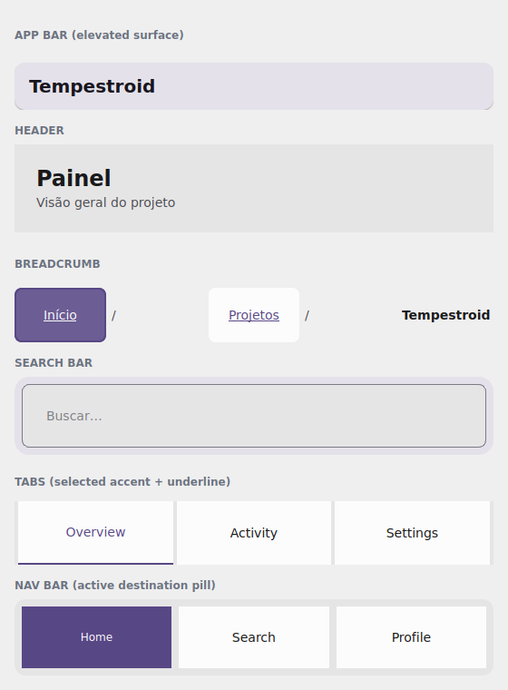

# Navigation

You already have action ([variants](variantes.en.md), [kit](kit.en.md)), the
frame ([surface](superficie.en.md)) and the conversation
([feedback](feedback.en.md)). What's missing is the **navigation shell**: the top
bar, the tab strip, the bottom navigation, the search, the page trail. This page
styles that layer — every component resolves the **M3 surfaces** and the
**active-item accent** from `color_scheme`/`theme`, with no hand-set colors.

{ width=300 }

*The `examples/h5gallery` example in the Qt simulator: `AppBar`, `Header`,
`Breadcrumb`, `SearchBar`, `Tabs` and `NavBar` — all theme-tinted.*

!!! info "Where the names live"
    Everything on this page imports from **`tempestroid`**: the navigation
    components (`AppBar`, `CollapsingAppBar`, `NavBar`, `Drawer`, `Sidebar`,
    `Breadcrumb`, `Burger`, `Footer`, `Header`, `Scaffold`, `SearchBar`, `Tabs`)
    and `Theme`.

## The `AppBar` and the `Header`

The `AppBar` is the top bar — an M3 **elevated surface** with a title, a
`leading` widget (back/menu button) and a list of `actions` on the right. The
`color_scheme` sets the role of the surface and its content:

```python
from tempestroid import AppBar, Button, Variant, Widget


def barra(theme) -> Widget:  # theme: Theme
    return AppBar(
        title="Tempestroid",
        color_scheme="primary",
        actions=[
            Button(label="Sair", variant=Variant.GHOST, theme=theme, key="out"),
        ],
        theme=theme,
    )
```

The `Header` is the content heading (not the system bar): a large title +
subtitle, over the page surface.

```python
from tempestroid import Header, Widget


def cabecalho(theme) -> Widget:  # theme: Theme
    return Header(
        title="Painel",
        subtitle="Visão geral do projeto",
        theme=theme,
    )
```

!!! tip "A bar that collapses on scroll"
    `CollapsingAppBar` is the `AppBar` that shrinks as the screen scrolls: pass
    the `scroll_offset` (from the `ScrollEvent`) and it interpolates between
    `expanded_height` and `collapsed_height`. It marries the
    [collapsible app bar from E6](../widgets/layout.en.md) with the theme tokens.

## `Tabs` — the M3 tab strip

`Tabs` is the styled tab strip: a list of labels (`tabs`), the active index
(`active`) and an `on_select(index)` handler. The active tab gets the
**`color_scheme` accent** plus an underline:

```python
from tempestroid import Tabs, Widget


def abas(theme, ativa: int) -> Widget:  # theme: Theme
    return Tabs(
        tabs=["Visão geral", "Atividade", "Ajustes"],
        active=ativa,
        on_select=lambda i: None,  # swap the index in your state
        color_scheme="primary",
        theme=theme,
    )
```

!!! note "`Tabs` is the strip; the screens are yours"
    `Tabs` only draws and emits the selection — it does not swap content by
    itself. Keep the index in state, render the active tab's body and update via
    `app.set_state`. For a screen stack with an animated transition, use the
    [navigation `TabView`/`Navigator`](../navegacao.en.md).

## `NavBar` — the bottom navigation

`NavBar` is the destination bar (M3 "bottom navigation" style): labels via
`items`, the active destination via `active`, and `on_select(index)`. The active
item gets the **accent pill** from `color_scheme`:

```python
from tempestroid import NavBar, Widget


def navegacao(theme, ativo: int) -> Widget:  # theme: Theme
    return NavBar(
        items=["Início", "Buscar", "Perfil"],
        active=ativo,
        on_select=lambda i: None,
        color_scheme="primary",
        theme=theme,
    )
```

## `SearchBar` and `Breadcrumb`

The `SearchBar` is the M3 search field — a `field_variant` over the surface, with
`value`, `placeholder`, `on_change(text)` and an optional `on_clear`. The
`Breadcrumb` is the page trail: a list of labels (`items`) with a `separator` and
`on_select(index)`.

```python
from tempestroid import Breadcrumb, SearchBar, VStack, Widget


def busca_e_caminho(theme, consulta: str) -> Widget:  # theme: Theme
    return VStack(
        gap="md",
        theme=theme,
        children=[
            SearchBar(
                value=consulta,
                placeholder="Buscar…",
                on_change=lambda q: None,  # keep it in state
                color_scheme="primary",
                theme=theme,
            ),
            Breadcrumb(
                items=["Início", "Projetos", "Tempestroid"],
                on_select=lambda i: None,
                theme=theme,
            ),
        ],
    )
```

!!! tip "The rest of the shell"
    The same layer brings `Drawer`/`Sidebar` (the side drawer), `Burger` (the
    menu button), `Footer`, and `Scaffold` (the top-bar + body + bottom-bar
    skeleton that ties it together). All follow the theme and accept
    `color_scheme`. See the full catalog in the
    [widgets overview](../widgets.en.md) and the
    [public API](../../referencia/api.en.md).

## Full example: the navigation gallery

`examples/h5gallery/app.py` draws the whole shell — `AppBar`, `Header`,
`Breadcrumb`, `SearchBar` (type and the state updates), `Tabs` (a tap swaps the
active tab) and `NavBar` (a tap swaps the destination), all theme-tinted:

```bash
uv run python examples/h5gallery/app.py
# or: make run APP=examples/h5gallery/app.py
```

The full source is in
[`examples/h5gallery/app.py`](https://github.com/mauriciobenjamin700/tempestroid/blob/main/examples/h5gallery/app.py).
On the device, the same `view`/`make_state` loads in the Compose host: because
the whole layer is **composite components** (they lower to primitives via
`Component.render`), they render through the primitive children on **both
renderers**, over the resolved theme surfaces and accent.

## Recap

- The `AppBar` is the top bar (elevated surface + `leading`/`actions`); the
  `Header` is the content heading; `CollapsingAppBar` shrinks on scroll via
  `scroll_offset`.
- `Tabs` is the M3 tab strip (`tabs`/`active`/`on_select`), with an accent +
  underline on the active tab — you keep the index and render the body.
- `NavBar` is the bottom navigation (`items`/`active`/`on_select`) with an accent
  pill on the active destination.
- `SearchBar` is the search field (`value`/`on_change`/`on_clear`); `Breadcrumb`
  is the page trail (`items`/`on_select`).
- `Drawer`/`Sidebar`/`Burger`/`Footer`/`Scaffold` complete the shell — everything
  follows the theme and `color_scheme`.

Next: the [research components](pesquisa.en.md) — metrics, charts and the
`ort-vision-sdk` bridge.
