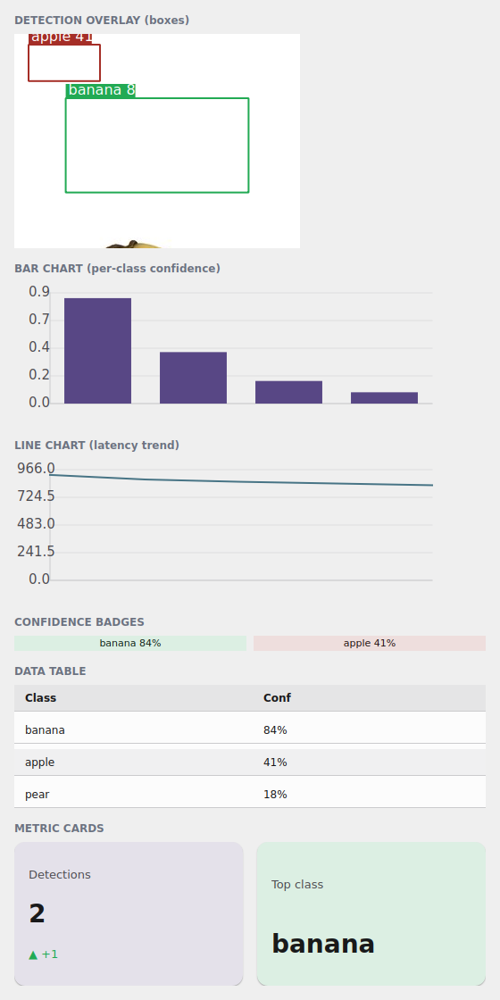

# Componentes de pesquisa

O design system foi pensado para que **pesquisadores acadêmicos** montem apps
Android de validação com pouco esforço e visual profissional. Esta página fecha
a vitrine com a camada **científica / data-science**: cartões de métrica,
gráficos de dados, sobreposição de detecções e a tabela de resultados — a ponte
direta com o [`ort-vision-sdk`](https://github.com/mauriciobenjamin700/ort-vision-sdk).

{ width=300 }

*O exemplo `examples/h6gallery` no simulador Qt: `DetectionOverlay`, `BarChart`,
`LineChart`, `ConfidenceBadge`, `DataTable` e `MetricCard` — um dashboard de
resultado de visão, todo tingido pelo tema.*

!!! info "Onde os nomes moram"
    Tudo desta página é importado de **`tempestroid`**: os componentes
    (`MetricCard`, `StatCard`, `ConfidenceBadge`, `LineChart`, `BarChart`,
    `DetectionOverlay`, `ResultView`, `DataTable`, `Calendar`, `Clock`), os
    objetos de dados (`ChartSeries`, `DetectionBox`) e o helper
    `confidence_scheme`.

## `MetricCard` e `StatCard` — o KPI

`MetricCard` é o cartão de métrica de uma tela de pesquisa: um número grande, um
rótulo e um *delta* opcional (a variação, verde para cima / vermelho para baixo
via `delta_up`). `StatCard` é o mesmo cartão em variante mais densa.

```python
from tempestroid import HStack, MetricCard, Widget


def metricas(theme) -> Widget:  # theme: Theme
    return HStack(
        gap="md",
        theme=theme,
        children=[
            MetricCard(label="Detecções", value="2", delta="+1", delta_up=True,
                       color_scheme="primary", theme=theme, key="m1"),
            MetricCard(label="Classe top", value="banana",
                       color_scheme="success", theme=theme, key="m2"),
        ],
    )
```

## `ConfidenceBadge` — a pílula de confiança

`ConfidenceBadge` mostra um score de confiança como uma pílula colorida. Você
passa `confidence` (um `float` em `[0,1]`) e um `label`; o componente escolhe o
`color_scheme` pelo limiar via `confidence_scheme` — alto → `success`, médio →
`warning`, baixo → `error` — sempre com contraste WCAG-AA.

```python
from tempestroid import ConfidenceBadge, HStack, Widget


def confiancas(theme) -> Widget:  # theme: Theme
    return HStack(
        gap="sm",
        theme=theme,
        children=[
            ConfidenceBadge(confidence=0.84, label="banana", theme=theme, key="c1"),
            ConfidenceBadge(confidence=0.41, label="apple", theme=theme, key="c2"),
        ],
    )
```

!!! tip "O limiar é configurável"
    `confidence_scheme(conf, *, high=0.8, mid=0.5)` é o seletor compartilhado: é
    a mesma função que o `DetectionOverlay` usa para tingir as caixas. Chame-a
    direto se quiser o `color_scheme` (`"success"`/`"warning"`/`"error"`) de um
    score em outro componente.

## `LineChart` e `BarChart` — dados viram desenho

Os gráficos transformam dados em comandos de `Canvas` (a mesma lista JSON da
conformância, idêntica nos dois renderizadores). `BarChart` recebe `values` +
`labels`; `LineChart` recebe uma lista de `ChartSeries` (cada série com `points`,
`label` e `color_scheme`):

```python
from tempestroid import BarChart, Widget


def barras(theme) -> Widget:  # theme: Theme
    return BarChart(
        values=[0.84, 0.41, 0.18, 0.09],
        labels=["banana", "apple", "pear", "lemon"],
        width=480.0,
        height=160.0,
        color_scheme="primary",
        theme=theme,
    )
```

```python
from tempestroid import ChartSeries, LineChart, Widget


def linha(theme) -> Widget:  # theme: Theme
    return LineChart(
        series=[
            ChartSeries(
                points=[920.0, 880.0, 860.0, 845.0, 830.0],
                label="latência ms",
                color_scheme="secondary",
            ),
        ],
        width=480.0,
        height=160.0,
        theme=theme,
    )
```

## `DetectionOverlay` — a ponte com o `ort-vision-sdk`

`DetectionOverlay` desenha uma imagem com **caixas delimitadoras** por cima —
exatamente a forma que um app de visão produz. Você passa `image_src` (caminho ou
URL) e uma lista de `DetectionBox`, e o componente tinge cada caixa pela
confiança (via `confidence_scheme`).

```python
from tempestroid import DetectionBox, DetectionOverlay, Widget


def deteccoes(theme) -> Widget:  # theme: Theme
    return DetectionOverlay(
        image_src="/caminho/para/banana.jpg",
        boxes=[
            DetectionBox(x1=0.18, y1=0.30, x2=0.82, y2=0.74, name="banana", conf=0.84),
            DetectionBox(x1=0.05, y1=0.05, x2=0.30, y2=0.22, name="apple", conf=0.41),
        ],
        width=320.0,
        height=240.0,
        theme=theme,
    )
```

!!! tip "`DetectionBox` é normalizado — e o motor não conhece o SDK"
    Os campos `x1`/`y1`/`x2`/`y2` de um `DetectionBox` são **xyxy normalizado em
    `[0,1]`** (frações da largura/altura da imagem), não pixels — o
    `DetectionOverlay` escala para o tamanho que você der. O motor **não tem
    dependência do `ort-vision-sdk`**: o adaptador que converte o resultado do
    `Detector.predict(...)` em `DetectionBox`es mora no **seu app**. Você lê os
    boxes do SDK (em pixels), divide por largura/altura e monta a lista — o
    design system só desenha.

## `DataTable` — a tabela de resultados

`DataTable` é a tabela estilizada com **ordenação e paginação**: `columns` +
`rows` (uma lista de listas de células). Ela segue o tema e zebra as linhas.

```python
from tempestroid import DataTable, Widget


def tabela(theme) -> Widget:  # theme: Theme
    return DataTable(
        columns=["Classe", "Conf"],
        rows=[["banana", "84%"], ["apple", "41%"], ["pear", "18%"]],
        theme=theme,
    )
```

!!! tip "Mais componentes de pesquisa"
    A mesma camada traz `ResultView` (o invólucro imagem→resultado), e os
    utilitários de tempo `Calendar`/`Clock`. Todos seguem o tema. Veja o catálogo
    completo na [visão geral de widgets](../widgets.md) e na
    [API pública](../../referencia/api.md).

## Exemplo completo: o dashboard de visão

`examples/h6gallery/app.py` desenha um dashboard de resultado de visão completo —
`DetectionOverlay` com caixas sobre uma imagem real, dois `MetricCard`, a dupla de
`ConfidenceBadge`, o `BarChart` de confiança por classe, o `LineChart` de
latência e a `DataTable` de detecções:

```bash
uv run python examples/h6gallery/app.py
# ou: make run APP=examples/h6gallery/app.py
```

O fonte completo está no
[`examples/h6gallery/app.py`](https://github.com/mauriciobenjamin700/tempestroid/blob/main/examples/h6gallery/app.py).
No aparelho, o mesmo `view`/`make_state` carrega no host Compose; como toda a
camada é de **componentes compostos**, os gráficos descem ao `Canvas` e as
métricas aos primitivos nos **dois renderizadores**.

## Recapitulando

- `MetricCard`/`StatCard` são o KPI (número + `delta`/`delta_up` + `color_scheme`).
- `ConfidenceBadge` é a pílula de confiança; o limiar vem de
  `confidence_scheme(conf, *, high=0.8, mid=0.5)`, AA-safe.
- `BarChart`/`LineChart` transformam dados (`values`/`labels` ou `ChartSeries`)
  em comandos de `Canvas` idênticos nos dois renderizadores.
- `DetectionOverlay` desenha imagem + `DetectionBox`es **xyxy normalizado `[0,1]`**,
  tingidos por confiança — a ponte com o `ort-vision-sdk`, cujo adaptador é do app
  (o motor não depende do SDK).
- `DataTable` é a tabela com ordenação/paginação; `ResultView`/`Calendar`/`Clock`
  completam a camada.

A seguir: o [storybook (galeria)](storybook.md) — o sistema inteiro em um app só,
com os toggles de claro/escuro e LTR/RTL.
