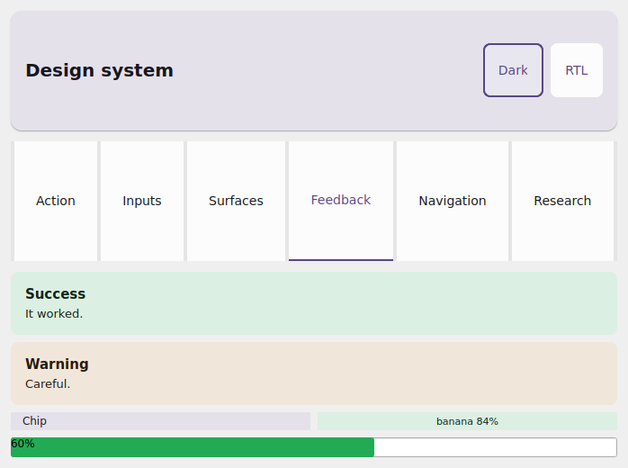
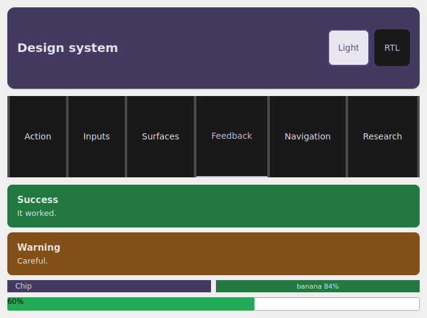
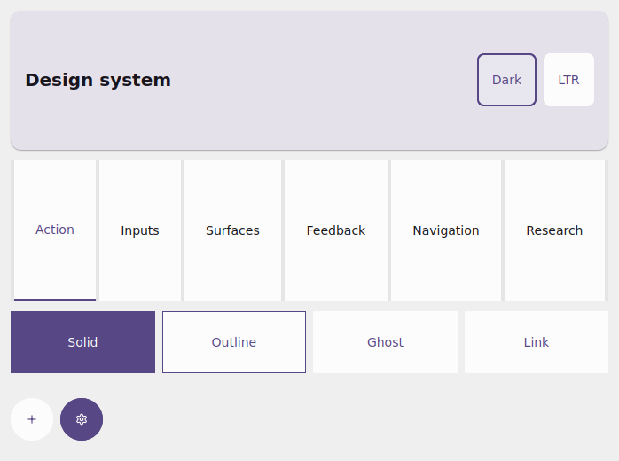

# Storybook (galeria)

Você percorreu o design system inteiro: [tokens](tokens.md) →
[variantes](variantes.md) → [kit](kit.md) → [superfície](superficie.md) →
[feedback](feedback.md) → [navegação](navegacao.md) → [pesquisa](pesquisa.md).
Esta é a **capstone**: um único app que reúne **todos** os componentes H1–H6 numa
galeria navegável — o jeito de ver o sistema funcionando junto, e de provar que os
toggles de tema re-pintam tudo de uma vez.

{ width=260 }
{ width=260 }
{ width=260 }

*O mesmo app `examples/storybook` no simulador Qt: **claro**, **escuro** e **RTL**.
Os mesmos componentes, re-pintados pelos toggles — uma só fonte de verdade para o
tema.*

## O que o storybook mostra

`examples/storybook/app.py` é uma galeria estilo Storybook:

- uma **`AppBar`** com dois toggles: **claro/escuro** e **LTR/RTL**;
- uma faixa de **`Tabs`** que alterna entre categorias — **Action**, **Inputs**,
  **Surfaces**, **Feedback**, **Navigation** e **Research**;
- um espécime representativo de **cada** componente H1–H6 dentro de sua categoria.

Cada categoria mapeia para uma página deste guia:

| Categoria | Componentes | Guia |
|---|---|---|
| Action | `Button`, `IconButton` (variantes/tamanhos) | [variantes](variantes.md) |
| Inputs | `Input`, `Checkbox`, `Switch`, `Slider` | [kit](kit.md) |
| Surfaces | `Card`, `Surface`, `Divider` | [superfície](superficie.md) |
| Feedback | `Alert`, `Chip`, `ConfidenceBadge`, `ProgressBar` | [feedback](feedback.md) |
| Navigation | `NavBar`, `Divider` (sob a `AppBar`/`Tabs`) | [navegação](navegacao.md) |
| Research | `MetricCard`, `BarChart`, `DetectionOverlay` | [pesquisa](pesquisa.md) |

## Como rodar

```bash
uv run python examples/storybook/app.py
# ou: make run APP=examples/storybook/app.py
```

Toque nas abas para trocar de categoria; toque em **Dark**/**Light** e
**RTL**/**LTR** na `AppBar` para re-pintar o sistema inteiro ao vivo. O fonte
completo está no
[`examples/storybook/app.py`](https://github.com/mauriciobenjamin700/tempestroid/blob/main/examples/storybook/app.py).

## A mágica: um tema, o sistema todo

!!! note "Dark mode + RTL são propriedade do app, não de cada widget"
    Todo componente estilizado aceita um **`theme=`**. O app lê `app.theme`
    (claro/escuro) e `app.locale` (LTR/RTL) **como contexto** e os repassa a cada
    componente do `view`. Os toggles só chamam `app.set_theme(...)` /
    `app.set_locale(...)`; o rebuild coalescido reconstrói o `view` com o novo
    tema/locale, e **todos** os componentes resolvem suas cores e espelhamento de
    novo. É por isso que um toque re-pinta a galeria inteira — e é exatamente a
    **superfície de verificação de dark/RTL** do design system.

O esqueleto do `view` do storybook é literalmente isto — lê o contexto, monta os
toggles, despacha para a categoria ativa:

```python
from tempestroid import App, Locale, Theme, ThemeMode, Widget


def view(app: App[object]) -> Widget:  # state: a categoria ativa
    theme = app.theme
    dark = theme.is_dark(platform_dark_mode=app.media.platform_dark_mode)
    rtl = app.locale.rtl

    def _toggle_dark() -> None:
        app.set_theme(Theme(mode=ThemeMode.LIGHT if dark else ThemeMode.DARK))

    def _toggle_rtl() -> None:
        app.set_locale(
            Locale(language="pt", region="BR", rtl=False)
            if rtl
            else Locale(language="ar", region="EG", rtl=True)
        )

    ...  # AppBar(actions=[toggle dark, toggle RTL]) + Tabs + corpo da categoria
```

Cada espécime recebe esse mesmo `theme` — por exemplo, a categoria Action:

```python
from tempestroid import Button, HStack, IconButton, Variant, Widget


def action(theme) -> Widget:  # theme: Theme
    return HStack(
        gap="sm",
        theme=theme,
        children=[
            Button(label="Solid", variant=Variant.SOLID, theme=theme, key="b1"),
            Button(label="Outline", variant=Variant.OUTLINE, theme=theme, key="b2"),
            Button(label="Ghost", variant=Variant.GHOST, theme=theme, key="b3"),
            IconButton(icon="add", label="Add", theme=theme, key="ib"),
        ],
    )
```

!!! tip "Use o storybook como banco de provas"
    Quando você adicionar um componente ou ajustar um token, abra o storybook e
    alterne claro/escuro + LTR/RTL: se a cor resolve e o layout espelha em todas
    as combinações, o componente está conforme. É a forma mais rápida de pegar uma
    regressão de contraste ou de espelhamento RTL antes de levar ao aparelho.

## Recapitulando

- `examples/storybook/app.py` é o tour de um app só por **todo** o design system
  H1–H6, organizado em abas por categoria (Action/Inputs/Surfaces/Feedback/
  Navigation/Research).
- A `AppBar` traz os toggles **claro/escuro** e **LTR/RTL**; cada um chama
  `app.set_theme`/`app.set_locale`.
- Todo componente recebe `theme=`; o app lê `app.theme`/`app.locale` como
  contexto, então um toque **re-pinta o sistema inteiro ao vivo** — a superfície
  de verificação de dark/RTL.
- Rode com `uv run python examples/storybook/app.py`.

Para o catálogo completo de widgets e a referência de API, veja a
[visão geral de widgets](../widgets.md) e a
[API pública](../../referencia/api.md).
