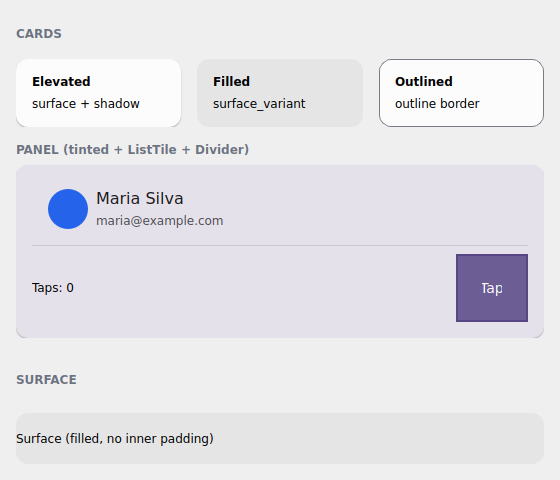

# Surface & layout

The [action and entry kit](kit.en.md) gave the controls their ergonomics. What's
missing is the **frame**: the cards, surfaces and spacers that organize the
screen. tempestroid ships that layer with the **same** variant API you already
know — except the axis here is Material 3 *elevation*, not button emphasis.

{ width=300 }

*The `examples/h3gallery` example in the Qt simulator: the three `Card` variants,
a tinted panel with `ListTile` + `Divider`, and a bare `Surface`.*

!!! info "Where the names live"
    Everything on this page imports from **`tempestroid`**: the widgets (`Card`,
    `Surface`, `HStack`, `VStack`, `Spacer`, `Divider`, `ListTile`), the
    `CardVariant` enum and `Theme`/`Color`. `tempest_core` is just the engine
    underneath — you never import it.

## `Card` and the three Material 3 variants

A `Card` groups content on a surface with rounded corners and inner padding. The
`variant` prop (the `CardVariant` enum) picks the M3 treatment — and, just like
`Button`, the engine resolves the `Style` from the `theme`, with no hand-set
colors:

| `CardVariant` | Treatment |
|---|---|
| `ELEVATED` | surface + **shadow** (the elevation becomes a `Shadow`) — the default |
| `FILLED` | tonal fill (`surface_variant`), no shadow |
| `OUTLINED` | thin border in the `outline` color, surface background |

```python
from tempestroid import Card, CardVariant, Text, Widget


def cards(theme) -> Widget:  # theme: Theme
    return Card(
        variant=CardVariant.ELEVATED,
        theme=theme,
        children=[
            Text(content="Título"),
            Text(content="Conteúdo do cartão"),
        ],
    )
```

!!! tip "The spacing steps come from the theme"
    `Card` carries `padding_step` / `radius_step` / `gap_step` (defaults `"md"` /
    `"md"` / `"sm"`) — steps of the theme's 4dp scale, not loose pixels. Switch
    to `"sm"` or `"lg"` and the card breathes in step with the rest of the app.

### Tinting a card with `color_scheme`

A `Card` accepts `color_scheme` to tint the surface in a
[color role](tokens.en.md#the-color-roles-color-schemes) (the default is
`"neutral"`). Handy to highlight a panel without leaving the theme:

```python
from tempestroid import Card, CardVariant, Text, Widget


def painel(theme) -> Widget:  # theme: Theme
    return Card(
        variant=CardVariant.ELEVATED,
        color_scheme="primary",  # surface tinted in the accent
        theme=theme,
        children=[Text(content="Painel em destaque")],
    )
```

## `Surface` — the bare primitive

`Card` is a convenience over `Surface`: the `Surface` applies the **same**
variant resolution (`ELEVATED`/`FILLED`/`OUTLINED` + `color_scheme` +
`radius_step`), but **with no inner padding** and holding **one** child (`child`,
not `children`). Use it when you want to control the spacing yourself:

```python
from tempestroid import CardVariant, Surface, Text, Widget


def superficie(theme) -> Widget:  # theme: Theme
    return Surface(
        variant=CardVariant.FILLED,
        theme=theme,
        child=Text(content="Superfície preenchida, sem padding interno"),
    )
```

!!! note "Card builds on Surface"
    Think of `Card` as `Surface` + padding + a `Column` of your `children`. When
    the card's built-in padding doesn't fit, drop to `Surface` and build the
    inside yourself.

## Stack helpers: `HStack`, `VStack`, `Spacer`

For day-to-day arrangement, the stack helpers are `Row`/`Column` with **named
theme gaps** instead of a pixel number. `HStack` stacks horizontally, `VStack`
vertically; the `gap` takes a step of the spacing scale
(`"xs"`/`"sm"`/`"md"`/`"lg"`/`"xl"`):

```python
from tempestroid import HStack, Spacer, Text, VStack, Widget


def barra(theme) -> Widget:  # theme: Theme
    return HStack(
        gap="md",
        theme=theme,
        children=[
            Text(content="Início"),
            Spacer(),  # pushes what follows to the opposite edge
            Text(content="Configurações"),
        ],
    )


def coluna(theme) -> Widget:  # theme: Theme
    return VStack(
        gap="sm",
        theme=theme,
        children=[Text(content="Linha 1"), Text(content="Linha 2")],
    )
```

`Spacer` is the elastic space: it grows to fill the main axis, so a `Spacer`
between two children of an `HStack` throws the second one to the far edge.
Control the proportion with `flex` (default `1.0`).

## Themed `Divider` and `ListTile`

`Divider` is a thin rule that follows the theme's `outline` color (or a
`color_scheme` you pass); `ListTile` is the classic list row — `title` +
`subtitle` + `leading`/`trailing` slots (which take any widget, like an
`Avatar`):

```python
from tempestroid import Avatar, Divider, ListTile, VStack, Widget


def lista(theme) -> Widget:  # theme: Theme
    return VStack(
        gap="xs",
        theme=theme,
        children=[
            ListTile(
                title="Maria Silva",
                subtitle="maria@example.com",
                leading=Avatar(label="MS"),
                theme=theme,
            ),
            Divider(theme=theme),
            ListTile(title="João Souza", subtitle="joao@example.com", theme=theme),
        ],
    )
```

## Full example: the surface gallery

`examples/h3gallery/app.py` puts it all together — the three `Card` variants side
by side, a tinted card with `ListTile` + `Divider` + an action row that uses
`Spacer` to push the button to the edge, and a bare `Surface`:

```bash
uv run python examples/h3gallery/app.py
# or: make run APP=examples/h3gallery/app.py
```

On the device, the same `view`/`make_state` loads in the Compose host: because
`Card`, `Surface`, `HStack`, `VStack`, `Divider` and `ListTile` are **composite
components** (they lower to primitives via `Component.render`), they render
through their primitive children on **both renderers** — with no dedicated Kotlin
branch.

!!! check "Surface divergence"
    The `ELEVATED` shadow becomes a `Shadow` resolved from the M3 elevation and
    follows both `Style` translators. The geometry (radius, padding) comes from
    the theme steps — identical on both renderers. See the
    [renderer coverage](../../referencia/cobertura.en.md) for the full table.

## Recap

- `Card` groups content on an M3 surface; `variant` picks `ELEVATED` (shadow) /
  `FILLED` (tonal) / `OUTLINED` (border) and the engine resolves the `Style` from
  the theme.
- `padding_step`/`radius_step`/`gap_step` come from the theme's **4dp scale**,
  not loose pixels; `color_scheme` tints the surface in a color role.
- `Surface` is the bare primitive the `Card` uses — same variant resolution,
  **no padding** and a single `child`.
- `HStack`/`VStack` are `Row`/`Column` with a **named theme gap**; `Spacer` grows
  to push its neighbors.
- `Divider`/`ListTile` follow the theme (rule + the classic list row with
  `leading`/`trailing`).
- It's all **composite components** → it renders through the primitives on both
  renderers.

Next: [data display & feedback](feedback.en.md) — `Alert`/`Banner`, the
`Badge`/`Chip`/`Tag` family, `Stat`, `ProgressStepper` and the status
`color_scheme`s.
