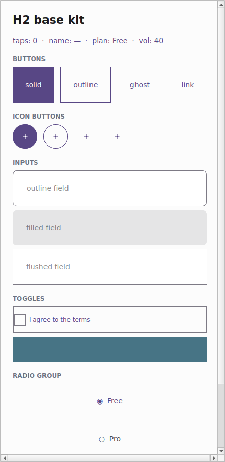
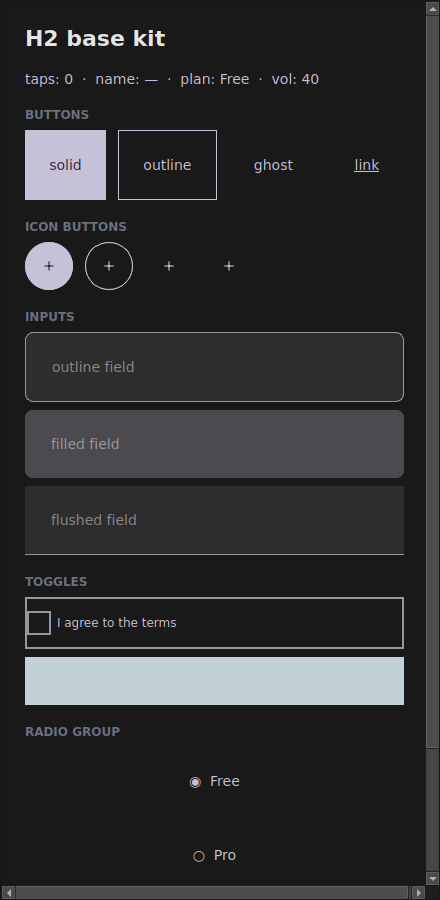

# Theme and tokens

So far you've styled every widget by hand: `Color.from_hex("#2563eb")` here, a
`12.0` radius there, an `Edge.all(16.0)` padding somewhere else. It works, but it
scatters brand decisions across the whole app — and when **dark mode** arrives,
you rewrite every color. The tempestroid **design system** fixes this: a `Theme`
carries a set of **Material 3 tokens** (colors, spacing, shape, typography,
elevation, motion), and components read those tokens instead of raw values.

!!! info "Where the tokens come from"
    The design engine (`Theme`, `TokenSet`, variants) is implemented in the
    **`tempest-core`** package, installed alongside tempestroid. But you don't
    import it: the whole design-system surface — `Theme`, `ThemeMode`,
    `ColorRole`, `TokenSet`, `TokenRef`, `Variant` and friends — is
    **re-exported by `tempestroid`**, so you import everything from one place,
    like any other widget or enum.

## A `Theme` in one line

The entry point is `Theme.from_seed(...)`: give it **one** brand color and get a
complete Material 3 palette back — light and dark, every color role filled in,
with contrast guaranteed.

```python
from tempestroid import Color, Theme

theme = Theme.from_seed(Color.from_hex("#2563eb"))

# The seed becomes a whole M3 tonal scheme:
print(theme.color("primary").to_hex())     # the light scheme's primary role
print(theme.color("on_primary").to_hex())  # legible content over primary
print(theme.space("md"))                    # 16.0 — default gutter (4dp grid)
print(theme.radius("lg"))                   # 16.0 — large corner radius
print(theme.elevation(2))                   # 3.0 — elevation level 2, in dp
```

!!! tip "No brand color yet?"
    Build `Theme()` with no arguments: you get the Material 3 baseline theme (the
    reference purple `#6750A4`). Everything on this page works the same.

## The color roles (color schemes)

Material 3 doesn't paint with raw colors — it paints with **semantic roles**.
Each role has an `on_*` pair that is the legible content drawn on top of it
(generated to meet WCAG-AA contrast). tempestroid exposes five role families,
which components pick via `color_scheme`:

| `color_scheme` | Base role | Content (`on_*`) | Typical use |
|---|---|---|---|
| `"primary"` | `primary` | `on_primary` | main action, active state |
| `"secondary"` | `secondary` | `on_secondary` | complementary accent |
| `"tertiary"` | `tertiary` | `on_tertiary` | contrasting accent |
| `"error"` | `error` | `on_error` | error / destructive action |
| `"neutral"` | `on_surface` | `surface` | low-emphasis, neutral treatment |

Beyond those, the full scheme carries the surface roles your app uses for the
page chrome — `surface` / `on_surface`, `background` / `on_background`,
`outline`, `surface_variant` and their `on_*`. Read any of them by `ColorRole`
or by string:

```python
from tempestroid import Color, ColorRole, Theme

theme = Theme.from_seed(Color.from_hex("#2563eb"))

surface = theme.color(ColorRole.SURFACE)
on_surface = theme.color(ColorRole.ON_SURFACE)
outline = theme.color("outline")  # a string resolves too
```

!!! note "Hand-pick accent seeds"
    `from_seed` derives secondary/tertiary by rotating the seed's hue. Want to
    pick each accent? Pass `secondary_seed` / `tertiary_seed` / `error_seed`, all
    `Color`.

## Light and dark with `ThemeMode`

The theme's mode decides which scheme (light or dark) the roles resolve to. The
same app, just swapping the `ThemeMode`, becomes:

{ width=280 }
{ width=280 }

There are three options:

=== "Force light/dark"

    ```python
    from tempestroid import Color, Theme, ThemeMode

    light = Theme.from_seed(Color.from_hex("#2563eb"), mode=ThemeMode.LIGHT)
    dark = Theme.from_seed(Color.from_hex("#2563eb"), mode=ThemeMode.DARK)

    print(light.color("background").to_hex())  # light surface
    print(dark.color("background").to_hex())    # dark surface
    ```

=== "Follow the system"

    ```python
    from tempestroid import Color, Theme, ThemeMode

    # SYSTEM resolves against the platform's dark mode at build time.
    theme = Theme.from_seed(Color.from_hex("#2563eb"), mode=ThemeMode.SYSTEM)
    print(theme.is_dark(platform_dark_mode=True))  # True when the OS is dark
    ```

`ThemeMode.SYSTEM` is the default: the app follows the device setting. To swap
the theme at runtime (a "dark mode" toggle in the app), use `App.set_theme(...)`
— see the `examples/theming/app.py` example.

## The systematic scales

Beyond colors, the `TokenSet` carries named Material 3 scales — you ask for
`"md"` instead of memorizing `16.0`:

| Scale | Access | Steps |
|---|---|---|
| **Spacing** (4dp grid) | `theme.space(name)` | `none` `xs` `sm` `md` `lg` `xl` `xxl` |
| **Shape** (radius) | `theme.radius(name)` | `none` `xs` `sm` `md` `lg` `xl` `full` |
| **Typography** | `theme.typography(role)` | `display_*` `headline_*` `title_*` `body_*` `label_*` |
| **Elevation** | `theme.elevation(level)` | levels `0`–`5`, in dp |
| **Motion** | `theme.tokens.motion` | durations + easing curves |

```python
from tempestroid import Color, Edge, Style, Theme

theme = Theme.from_seed(Color.from_hex("#2563eb"))

# Compose a Style from tokens, not magic numbers:
title = theme.typography("title_large")
card = Style(
    background=theme.color("surface_variant"),
    padding=Edge.all(theme.space("md")),
    radius=theme.radius("lg"),
    font_size=title.font_size,
    font_weight=title.font_weight,
)
```

!!! tip "`radius('full')` is the pill"
    The `full` step uses the `999.0` sentinel; the renderer reads it as a
    fully-rounded shape (pill/circle) and clamps it to the real box size.

## How a component reads the theme

The important part: **a component resolves its `Style` against the `theme` you
hand it.** The styled components (`Button`, `Input`, `Checkbox`, …) take a
`theme` parameter. Always pass the app's live theme and the component adapts its
look — dark mode included — without you rewriting a single color:

```python
from tempestroid import Button, Color, Theme, Variant

theme = Theme.from_seed(Color.from_hex("#2563eb"))

# The Button resolves background/color/radius from the given theme:
save = Button(
    label="Save",
    variant=Variant.SOLID,
    color_scheme="primary",
    theme=theme,
)
print(save.style.background)  # already the theme's "primary" role color
```

Swap the `theme` for a dark one and the same `Button` resolves dark colors.
That's why the example gallery (`examples/h2gallery/app.py`) passes
`theme=app.theme` to every component: the whole app follows one theme.

!!! info "Tokens are additive — raw `Style` still works"
    None of this breaks what you already have. A hand-written
    `Style(background=Color.from_hex(...))` keeps working. The theme is an
    **alternative, opt-in** source of values. You can even carry a `TokenRef`
    inside a `Style` (`Style(background=TokenRef.color("primary"))`) and let the
    theme resolve it at build time via `theme.resolve_style(...)`.

## Recap

- A **`Theme`** carries a Material 3 **`TokenSet`**: color schemes + scales for
  spacing/shape/typography/elevation/motion.
- **`Theme.from_seed("#rrggbb")`** turns a brand color into a complete M3 palette
  (light + dark), with contrast guaranteed.
- Colors are **semantic roles** (`primary`/`secondary`/`tertiary`/`error`/
  `neutral` + their `on_*` and the surface roles), not raw colors.
- **`ThemeMode`** (`LIGHT`/`DARK`/`SYSTEM`) decides which scheme resolves; swap
  it at runtime with `App.set_theme`.
- Ask for scales by name — `theme.space("md")`, `theme.radius("lg")`,
  `theme.typography("title_large")` — instead of magic numbers.
- **A component resolves against the `theme` you pass**: hand it
  `theme=app.theme` and everything follows the app's theme, dark mode included.

Next: the [Chakra-style variant API](variantes.md), where
`variant`/`size`/`color_scheme` become the ergonomic way to ask for a
theme-resolved `Style`.
