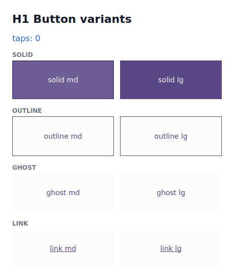

# Variantes ao estilo Chakra

Com o [tema e os tokens](tokens.md) no lugar, você não precisa montar um `Style`
a cada botão. Os componentes estilizados expõem uma API de **variantes** com a
ergonomia do Chakra UI — três props (`variant` / `size` / `color_scheme`) — e o
motor resolve, a partir do tema, um `Style` Material 3 completo, com estados de
interação e alvo de toque acessível. Você descreve a *intenção*; o design system
calcula os pixels.

!!! info "Onde os nomes moram"
    `variant`/`size`/`color_scheme` são props comuns; os **enums** `Variant`,
    `Size`, `ComponentState` e o widget `IconButton` são re-exportados por
    **`tempestroid`**, junto com `Button`, `Theme` e `Color`. Importe tudo de um
    único lugar — `tempest_core` é só o motor por baixo.

## O `Button` em uma linha

```python
from tempestroid import Button, Color, Size, Theme, Variant

theme = Theme.from_seed(Color.from_hex("#2563eb"))

salvar = Button(
    label="Salvar",
    variant=Variant.SOLID,
    size=Size.MD,
    color_scheme="primary",
    theme=theme,
    on_click=lambda: print("salvo!"),
)
```

Sem nenhuma prop além do `label`, você ganha um botão **solid / md / primary** —
os padrões. Tudo o mais é opcional e aditivo.

!!! tip "Override ainda funciona"
    Passou um `style=` explícito? Ele é **mesclado por cima** do estilo resolvido
    (os campos definidos vencem). Variantes não tiram o controle fino de você —
    só dispensam você de escrevê-lo quando não precisa.

## As quatro variantes

A prop `variant` (enum `Variant`) escolhe o *tratamento visual*, espelhando o
Material 3:

| `Variant` | Aparência |
|---|---|
| `SOLID` | preenchido com a cor do papel + conteúdo `on_*` legível (a ação de maior ênfase) |
| `OUTLINE` | fundo transparente, cor do papel como conteúdo **e** borda da mesma cor |
| `GHOST` | fundo transparente, cor do papel como conteúdo, **sem** borda |
| `LINK` | igual ao `ghost`, mais um sublinhado (parece um link de texto) |

```python
from tempestroid import Button, Color, Row, Theme, Variant

theme = Theme.from_seed(Color.from_hex("#2563eb"))

Row(
    style=...,
    children=[
        Button(label=v.value, variant=v, color_scheme="primary", theme=theme, key=v.value)
        for v in Variant  # SOLID, OUTLINE, GHOST, LINK
    ],
)
```

{ width=320 }

*As quatro variantes (`examples/h1buttons`) nos tamanhos `md`/`lg`, renderizadas
no simulador Qt.*

## Tamanhos e o alvo de toque de 48dp

A prop `size` (enum `Size`) controla a **densidade visual** — padding e tamanho
de fonte vêm das escalas do tema:

| `Size` | Densidade |
|---|---|
| `XS` | mais compacto |
| `SM` | compacto |
| `MD` | padrão |
| `LG` | maior |

!!! check "Acessibilidade embutida"
    Por menor que seja o `size`, o **alvo de toque nunca fica abaixo de 48dp** (o
    mínimo do Material 3). Um `XS` só reduz a aparência; a área tocável continua
    acessível. O contraste WCAG-AA entre papel e `on_*` também é garantido pelos
    tokens.

## Esquema de cor

A prop `color_scheme` escolhe a família de papéis Material 3 com que o
componente pinta — uma das cinco: `"primary"`, `"secondary"`, `"tertiary"`,
`"error"` ou `"neutral"` (veja a [tabela de papéis](tokens.md#os-papeis-de-cor-color-schemes)).

```python
from tempestroid import Button, Color, Theme, Variant

theme = Theme.from_seed(Color.from_hex("#2563eb"))

excluir = Button(label="Excluir", variant=Variant.SOLID, color_scheme="error", theme=theme)
cancelar = Button(label="Cancelar", variant=Variant.OUTLINE, color_scheme="neutral", theme=theme)
```

!!! warning "Esquema inválido falha cedo"
    Passar um `color_scheme` fora das cinco famílias levanta `ValueError` na
    construção do componente — você descobre o erro na hora, não na renderização.

## Estados de interação (state layers M3)

Cada componente resolve não só o estilo de repouso, mas a tabela completa de
**estados de interação** — `default` / `hover` / `pressed` / `focus` /
`disabled` — como *state layers* do Material 3 (a cor de conteúdo sobreposta ao
fundo nas opacidades M3). O componente entrega essa tabela ao renderizador, que
aplica o estilo certo nos eventos reais de ponteiro/foco:

```python
from tempestroid import Button, Color, Theme, Variant

theme = Theme.from_seed(Color.from_hex("#2563eb"))
botao = Button(label="Salvar", variant=Variant.SOLID, color_scheme="primary", theme=theme)

states = botao.state_styles()
# {ComponentState.DEFAULT: Style(...), ComponentState.HOVER: Style(...), ...}
print(sorted(s.value for s in states))
# ['default', 'disabled', 'focus', 'hover', 'pressed']
```

!!! note "A resolução é pura; o evento→estado fica no renderizador"
    `state_styles()` é uma função pura no motor — mesmos inputs, mesma saída — e
    é fixada na suíte de conformância. Cada renderizador só mapeia o evento real
    para o estado: o **Qt** usa pseudo-estados de QSS; o **Compose** usa
    `InteractionSource` + os state layers nativos do Material 3.

## Tamanho responsivo

`size` aceita também um mapa por breakpoint (estilo Chakra), resolvido
*mobile-first* contra os breakpoints do tema e a largura atual da viewport:

```python
from tempestroid import Button, Color, Size, Theme

theme = Theme.from_seed(Color.from_hex("#2563eb"))

responsivo = Button(
    label="Continuar",
    size={"base": Size.SM, "md": Size.LG},  # SM no celular, LG a partir de md
    color_scheme="primary",
    theme=theme,
)
```

A chave `"base"` é o tamanho de partida (largura 0); a partir de cada breakpoint
nomeado (`sm`/`md`/`lg`/`xl`) o tamanho daquele breakpoint vence quando a
viewport o alcança. O app passa a viewport via `media=` (um `MediaQueryData`); o
runtime já mantém esse contexto atualizado.

## Exemplo completo: a vitrine de variantes

O exemplo `examples/h1buttons/app.py` desenha a matriz de variantes ao vivo (e
um contador de toques para provar o caminho tap → handler → patch). Eis o
coração dele — um app `tempest` rodável de ponta a ponta:

```python
from __future__ import annotations

from dataclasses import dataclass

from tempestroid import (
    App,
    Button,
    Color,
    Column,
    Row,
    Size,
    Style,
    Text,
    Theme,
    Variant,
    Widget,
)


@dataclass
class State:
    taps: int = 0


def make_state() -> State:
    return State()


def view(app: App[State]) -> Widget:
    theme = Theme.from_seed(Color.from_hex("#2563eb"))

    def bump() -> None:
        app.set_state(lambda s: setattr(s, "taps", s.taps + 1))

    def variant_row(variant: Variant) -> Widget:
        return Row(
            style=Style(gap=12.0),
            key=f"row:{variant.value}",
            children=[
                Button(
                    label=f"{variant.value} {size.value}",
                    on_click=bump,
                    variant=variant,
                    size=size,
                    color_scheme="primary",
                    theme=theme,
                    key=size.value,
                )
                for size in (Size.MD, Size.LG)
            ],
        )

    return Column(
        style=Style(gap=16.0),
        children=[
            Text(content=f"toques: {app.state.taps}", key="taps"),
            variant_row(Variant.SOLID),
            variant_row(Variant.OUTLINE),
            variant_row(Variant.GHOST),
            variant_row(Variant.LINK),
        ],
    )


def main() -> int:
    # Importe o renderizador Qt de forma preguiçosa — o aparelho carrega
    # view/make_state deste mesmo arquivo e não tem PySide6.
    from tempestroid.renderers.qt import run_qt

    return run_qt(make_state(), view, title="H1 buttons", size=(420, 520))


if __name__ == "__main__":
    raise SystemExit(main())
```

Rode no simulador Qt:

```bash
uv run python examples/h1buttons/app.py
# ou: make run APP=examples/h1buttons/app.py
```

No aparelho, o mesmo `view`/`make_state` é carregado pelo host Compose; cada
variante mapeia para sua *affordance* Material 3 (filled / outlined / text), e o
Material 3 fornece os state layers nativos de press/hover/focus sobre as cores
resolvidas.

## Recapitulando

- A API de variantes é **três props**: `variant` (`SOLID`/`OUTLINE`/`GHOST`/
  `LINK`), `size` (`XS`/`SM`/`MD`/`LG`) e `color_scheme` (as cinco famílias M3).
- O motor resolve, a partir do `theme`, um `Style` M3 completo — você descreve a
  intenção, não os pixels.
- O **alvo de toque ≥ 48dp** e o **contraste WCAG-AA** são garantidos; um `size`
  menor muda só a densidade visual.
- Cada componente entrega a tabela de **estados** (`state_styles()`) como state
  layers M3; o renderizador aplica o estado no evento real (Qt QSS / Compose
  `InteractionSource`).
- `size` aceita um **mapa responsivo** (`{"base": Size.SM, "md": Size.LG}`),
  resolvido mobile-first contra os breakpoints do tema.
- `style=` explícito ainda é mesclado por cima — nada é tirado de você.

A seguir: o [kit de ação e entrada](kit.md) — `IconButton`, a família de campos
(`Input`/`Dropdown`/`Autocomplete`), os controles de seleção e os inputs BR.
