# Composite components

Composite components are ready-to-use, high-level UI building blocks.
Each one extends `Component` and implements a `render()` method that returns a
subtree of primitive widgets — `Column`, `Row`, `Container`, `Text`,
`Button`, etc. The reconciler and renderers treat them exactly like primitives:
no special cases, no extra code in Qt or Compose.

!!! info "Two renderers, zero extra code"
    Because components lower to primitives via `render()`, they work identically
    in the **Qt simulator** (desktop) and in **Compose on the device** without
    any renderer changes.

Always import from the package level — each component below shows the imports it
needs:

```python
from tempestroid import AppBar, Card, NavBar, Scaffold
```

---

## Cards and lists

### Card

An elevated surface that groups children vertically inside a rounded, shadowed
container.

```python
from tempestroid import Button, Card, Text

Card(
    children=[
        Text(content="Welcome!", key="t"),
        Button(label="Sign in", on_click=on_enter, key="btn"),
    ],
    key="welcome-card",
)
```

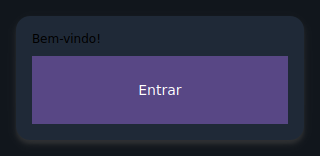

| Prop | Type | Default | Description |
|---|---|---|---|
| `children` | `list[Widget]` | `[]` | Widgets stacked vertically inside the card. |

---

### ListTile

A list row with a primary title, an optional subtitle, and leading/trailing
widget slots.

```python
from tempestroid import Avatar, Button, ListTile, TapEvent

async def on_delete(e: TapEvent) -> None:
    app.set_state(lambda s: s.remove_item(item_id))

ListTile(
    title="Maria Silva",
    subtitle="maria@example.com",
    leading=Avatar(initials="MS", key="av"),
    trailing=Button(label="✕", on_click=on_delete, key="del"),
    key="tile-1",
)
```

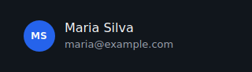

!!! note "Tapping the whole row"
    `ListTile` is presentational (no row-level `on_click`). For actions use a
    `Button` in the `trailing` slot, or wrap the tile in a label-less `Button`.

| Prop | Type | Default | Description |
|---|---|---|---|
| `title` | `str` | `""` | Primary text. |
| `subtitle` | `str \| None` | `None` | Secondary line shown muted below the title. |
| `leading` | `Widget \| None` | `None` | Widget before the text block (e.g. `Avatar`). |
| `trailing` | `Widget \| None` | `None` | Widget after the text block (e.g. `Button`). |

---

### Avatar

A circular badge showing short initials — great for profile icons or
placeholders.

```python
from tempestroid import Avatar

Avatar(initials="MB", size=48.0, key="profile-av")
```

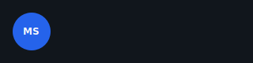

| Prop | Type | Default | Description |
|---|---|---|---|
| `initials` | `str` | `""` | Short text shown inside the circle (e.g. `"MB"`). |
| `size` | `float` | `40.0` | Circle diameter in logical pixels. |

---

### Divider

A thin horizontal rule for separating sections.

```python
from tempestroid import Column, Divider, Text

Column(
    children=[
        Text(content="Section A", key="a"),
        Divider(thickness=1.0, key="div"),
        Text(content="Section B", key="b"),
    ],
)
```

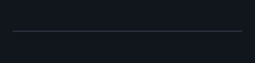

| Prop | Type | Default | Description |
|---|---|---|---|
| `thickness` | `float` | `1.0` | Line height in logical pixels. |

---

## Bars and navigation

### AppBar

Top application bar with a leading widget, a title, and trailing actions.

```python
from tempestroid import AppBar, Button, TapEvent

async def on_menu(e: TapEvent) -> None:
    app.set_state(lambda s: setattr(s, "drawer_open", True))

AppBar(
    title="My App",
    leading=Button(label="☰", on_click=on_menu, key="menu"),
    actions=[Button(label="⚙", on_click=on_settings, key="cfg")],
    key="appbar",
)
```

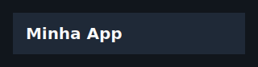

| Prop | Type | Default | Description |
|---|---|---|---|
| `title` | `str` | `""` | Title text. |
| `leading` | `Widget \| None` | `None` | Widget before the title (e.g. back button or `Burger`). |
| `actions` | `list[Widget]` | `[]` | Trailing action widgets. |

---

### Header

Page header band with a title and an optional subtitle on a distinct background.

```python
from tempestroid import Header

Header(title="Dashboard", subtitle="Daily overview", key="page-header")
```

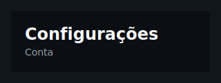

| Prop | Type | Default | Description |
|---|---|---|---|
| `title` | `str` | `""` | Primary heading text. |
| `subtitle` | `str \| None` | `None` | Muted secondary line below the title. |

---

### Footer

Bottom bar that centers arbitrary children (links, labels, actions).

```python
from tempestroid import Footer, Text

Footer(
    children=[
        Text(content="© 2026 My Company", key="copy"),
    ],
    key="footer",
)
```

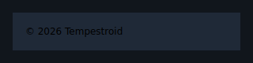

| Prop | Type | Default | Description |
|---|---|---|---|
| `children` | `list[Widget]` | `[]` | Widgets displayed in the bottom bar. |

---

### CollapsingAppBar

An app bar that shrinks as the user scrolls the content down. The height is
derived from `scroll_offset` — the app reads the scroll event from the list
and feeds the value back as state; no renderer logic is involved.

```python
from tempestroid import CollapsingAppBar, LazyColumn, ScrollEvent

async def on_scroll(e: ScrollEvent) -> None:
    app.set_state(lambda s: setattr(s, "offset", e.offset))

def view(app):
    return Column(children=[
        CollapsingAppBar(
            title="News",
            scroll_offset=app.state.offset,
            expanded_height=200.0,
            collapsed_height=56.0,
            key="cbar",
        ),
        LazyColumn(
            item_count=100,
            item_builder=build_item,
            on_scroll=on_scroll,
            key="list",
        ),
    ])
```

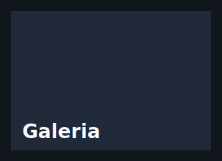

| Prop | Type | Default | Description |
|---|---|---|---|
| `title` | `str` | `""` | Title text. |
| `expanded_height` | `float` | `200.0` | Bar height when `scroll_offset == 0`. |
| `collapsed_height` | `float` | `56.0` | Minimum height after full collapse. |
| `scroll_offset` | `float` | `0.0` | Current scroll offset in logical pixels (comes from app state). |
| `background` | `Color \| None` | `None` | Background color (default: `SURFACE` token). |

---

### NavBar

Horizontal navigation/tab bar with the active item highlighted. Each item is a
button; tapping calls `on_select(index)`.

```python
from tempestroid import NavBar

NavBar(
    items=["Home", "Explore", "Profile"],
    active=app.state.tab,
    on_select=lambda i: app.set_state(lambda s: setattr(s, "tab", i)),
    key="navbar",
)
```

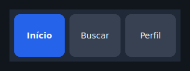

| Prop | Type | Default | Description |
|---|---|---|---|
| `items` | `list[str]` | `[]` | Item labels in order. |
| `active` | `int` | `0` | Index of the active item. |
| `on_select` | `handler → int` | — | Called with the tapped item's index. **Required.** |

---

### Breadcrumb

Navigation trail with a configurable separator. Non-final items are tappable
when `on_select` is provided; the last item is always presentational.

```python
from tempestroid import Breadcrumb

Breadcrumb(
    items=["Home", "Products", "Details"],
    separator="/",
    on_select=lambda i: app.navigate_to(i),
    key="bc",
)
```

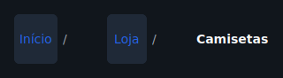

| Prop | Type | Default | Description |
|---|---|---|---|
| `items` | `list[str]` | `[]` | Labels from root to current page. |
| `separator` | `str` | `"/"` | Character drawn between crumbs. |
| `on_select` | `handler → int` | `None` | Called with the tapped crumb's index (not the last one). |

---

### Burger

Hamburger menu button — typically toggles a `Drawer`.

```python
from tempestroid import AppBar, Burger

AppBar(
    title="App",
    leading=Burger(
        on_click=lambda: app.set_state(lambda s: setattr(s, "open", True)),
        key="burger",
    ),
)
```

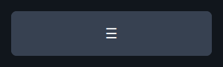

| Prop | Type | Default | Description |
|---|---|---|---|
| `on_click` | `handler` | — | Called when the button is tapped. **Required.** |
| `glyph` | `str` | `"☰"` | Icon character displayed. |

---

### Drawer

A controlled lateral panel. When `open=False` it collapses to an empty box;
when `open=True` it shows its children at the configured width.

```python
from tempestroid import Burger, Column, Drawer, Row, Text

Row(
    children=[
        Drawer(
            open=app.state.open,
            width=260.0,
            children=[
                Text(content="Menu", key="menu-title"),
                # navigation items...
            ],
            key="drawer",
        ),
        main_content,
    ],
)
```

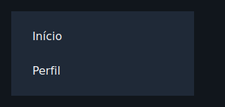

!!! warning "Drawer positioning"
    The `Drawer` uses the flex model: when open it occupies space in the parent
    row/column (it does not float over content). Use a `Row` with `Drawer` +
    content for the classic side-drawer pattern.

| Prop | Type | Default | Description |
|---|---|---|---|
| `open` | `bool` | `False` | Controls whether the panel is expanded. |
| `children` | `list[Widget]` | `[]` | Widgets inside the open panel. |
| `width` | `float` | `260.0` | Panel width in logical pixels. |

---

## Layout

### Scaffold

Page frame: top bar, growing body, and optional bottom bar. It is the starting
point for almost every screen.

```python
from tempestroid import AppBar, NavBar, Scaffold

Scaffold(
    app_bar=AppBar(title="Home", key="ab"),
    body=my_content,
    bottom_bar=NavBar(items=["A", "B", "C"], active=0, on_select=on_tab, key="nb"),
    scroll=True,
    key="scaffold",
)
```

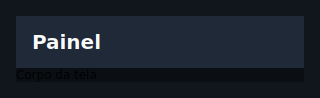

| Prop | Type | Default | Description |
|---|---|---|---|
| `app_bar` | `Widget \| None` | `None` | Top bar widget (typically `AppBar`). |
| `body` | `Widget \| None` | `None` | Main content (fills all remaining space). |
| `bottom_bar` | `Widget \| None` | `None` | Bottom bar (e.g. `NavBar` or `Footer`). |
| `scroll` | `bool` | `False` | When `True`, wraps the body in a `ScrollView`. |

---

### Sidebar

Fixed-width lateral column for navigation or secondary content.

```python
from tempestroid import Button, Row, Sidebar, TapEvent

Row(
    children=[
        Sidebar(
            width=240.0,
            children=[
                Button(label="Dashboard", on_click=on_dash, key="dash"),
                Button(label="Settings", on_click=on_cfg, key="cfg"),
            ],
            key="sidebar",
        ),
        main_content,
    ],
)
```

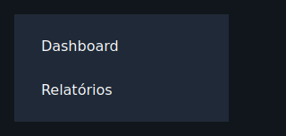

| Prop | Type | Default | Description |
|---|---|---|---|
| `children` | `list[Widget]` | `[]` | Widgets stacked top-to-bottom in the sidebar. |
| `width` | `float` | `240.0` | Fixed width in logical pixels. |

---

### Grid

Fixed-column grid: fills cells left-to-right then top-to-bottom. Short final
rows are padded with empty cells to preserve alignment.

```python
from tempestroid import Card, Grid, Text

Grid(
    columns=3,
    gap=12.0,
    children=[
        Card(children=[Text(content=f"Item {i}", key=f"t{i}")], key=f"c{i}")
        for i in range(9)
    ],
    key="grid",
)
```

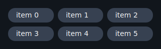

| Prop | Type | Default | Description |
|---|---|---|---|
| `children` | `list[Widget]` | `[]` | Cells filled left-to-right. |
| `columns` | `int` | `2` | Number of columns per row (minimum 1). |
| `gap` | `float` | `8.0` | Spacing between cells, both horizontal and vertical. |

---

## Selection and input

### SegmentedControl

Compact pill-group for single-choice selection.

```python
from tempestroid import SegmentedControl

SegmentedControl(
    options=["Day", "Week", "Month"],
    selected=app.state.period,
    on_select=lambda i: app.set_state(lambda s: setattr(s, "period", i)),
    key="period-ctrl",
)
```

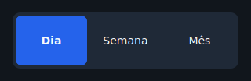

| Prop | Type | Default | Description |
|---|---|---|---|
| `options` | `list[str]` | `[]` | Segment labels in order. |
| `selected` | `int` | `0` | Index of the active segment. |
| `on_select` | `handler → int` | — | Called with the tapped segment's index. **Required.** |

---

### RadioGroup

Vertical single-choice list with radio markers (◉ / ○).

```python
from tempestroid import RadioGroup

RadioGroup(
    options=["Card", "Bank slip", "Pix"],
    selected=app.state.payment,
    on_select=lambda i: app.set_state(lambda s: setattr(s, "payment", i)),
    key="payment",
)
```

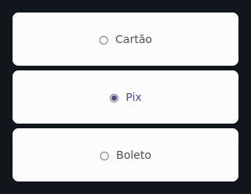

| Prop | Type | Default | Description |
|---|---|---|---|
| `options` | `list[str]` | `[]` | Option labels in order. |
| `selected` | `int` | `0` | Index of the chosen option. |
| `on_select` | `handler → int` | — | Called with the tapped option's index. **Required.** |

---

### Chip

Small rounded pill; can be selectable or purely visual. When `on_click` is
`None` the chip is presentational.

```python
from tempestroid import Chip, Row

Row(
    children=[
        Chip(
            label="Python",
            selected=True,
            on_click=lambda: app.toggle_tag("Python"),
            key="chip-py",
        ),
        Chip(label="Kotlin", key="chip-kt"),
    ],
)
```

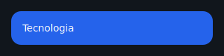

| Prop | Type | Default | Description |
|---|---|---|---|
| `label` | `str` | `""` | Text displayed in the chip. |
| `selected` | `bool` | `False` | When `True`, applies the accent color (meaningful with `on_click`). |
| `on_click` | `handler` | `None` | Called on tap; when `None` the chip is static. |

---

### Rating

A row of stars showing (and optionally setting) a rating. When `on_rate` is
`None`, the component is purely presentational.

```python
from tempestroid import Rating

Rating(
    value=app.state.stars,
    max_stars=5,
    on_rate=lambda v: app.set_state(lambda s: setattr(s, "stars", v)),
    key="rating",
)
```

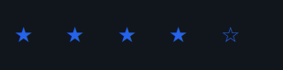

| Prop | Type | Default | Description |
|---|---|---|---|
| `value` | `int` | `0` | Number of filled stars. |
| `max_stars` | `int` | `5` | Total stars shown. |
| `on_rate` | `handler → int` | `None` | Called with the 1-based star value when tapped. |

---

### Stepper

Numeric stepper with − and + buttons and a centered value. Respects optional
bounds.

```python
from tempestroid import Stepper

Stepper(
    value=app.state.qty,
    step=1,
    min_value=1,
    max_value=99,
    on_change=lambda v: app.set_state(lambda s: setattr(s, "qty", v)),
    key="qty-stepper",
)
```

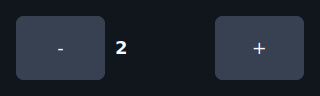

| Prop | Type | Default | Description |
|---|---|---|---|
| `value` | `int` | `0` | Current value. |
| `step` | `int` | `1` | Amount added/removed per tap. |
| `min_value` | `int \| None` | `None` | Lower bound (unbounded when `None`). |
| `max_value` | `int \| None` | `None` | Upper bound (unbounded when `None`). |
| `on_change` | `handler → int` | — | Called with the new (clamped) value. **Required.** |

---

### SearchBar

Controlled search field with an optional clear button. The clear button appears
only when `on_clear` is provided and the field is non-empty.

```python
from tempestroid import SearchBar, TextChangeEvent

async def on_change(e: TextChangeEvent) -> None:
    app.set_state(lambda s: setattr(s, "query", e.value))

SearchBar(
    value=app.state.query,
    placeholder="Search products...",
    on_change=on_change,
    on_clear=lambda: app.set_state(lambda s: setattr(s, "query", "")),
    key="search",
)
```

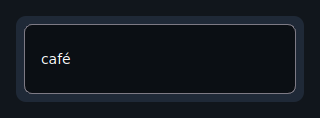

| Prop | Type | Default | Description |
|---|---|---|---|
| `value` | `str` | `""` | Current field text (controlled). |
| `placeholder` | `str` | `"Search"` | Hint shown when the field is empty. |
| `on_change` | `handler → TextChangeEvent` | — | Called on every edit with the validated event. **Required.** |
| `on_clear` | `handler` | `None` | Called when the ✕ button is tapped; the button only appears when this handler is provided and the field has text. |

---

## Feedback

### Banner

Inline status bar with a message and an optional trailing action.
Accepted tones: `"info"`, `"success"`, `"warning"`, `"error"`.

```python
from tempestroid import Banner, Button, TapEvent

async def on_dismiss(e: TapEvent) -> None:
    app.set_state(lambda s: setattr(s, "show_banner", False))

Banner(
    message="Connection restored.",
    tone="success",
    action=Button(label="OK", on_click=on_dismiss, key="ok"),
    key="banner",
)
```

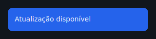

| Prop | Type | Default | Description |
|---|---|---|---|
| `message` | `str` | `""` | Message text. |
| `tone` | `str` | `"info"` | Background color: `"info"` / `"success"` / `"warning"` / `"error"`. |
| `action` | `Widget \| None` | `None` | Trailing action widget (e.g. dismiss `Button`). |

---

### EmptyState

Centered empty-screen placeholder: large glyph, title, subtitle, and optional
action.

```python
from tempestroid import Button, EmptyState, TapEvent

EmptyState(
    glyph="📭",
    title="No results",
    subtitle="Try refining your search.",
    action=Button(label="Clear filters", on_click=on_clear, key="clear"),
    key="empty",
)
```

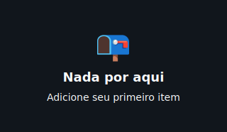

| Prop | Type | Default | Description |
|---|---|---|---|
| `title` | `str` | `""` | Primary message. |
| `subtitle` | `str \| None` | `None` | Secondary line. |
| `glyph` | `str` | `"○"` | Large character shown above the title. |
| `action` | `Widget \| None` | `None` | Call-to-action widget (e.g. `Button`). |

---

### Badge

Small inline status pill for a count or short label.

```python
from tempestroid import Badge, Row, Text

Row(
    children=[
        Text(content="Notifications", key="lbl"),
        Badge(label="3", tone="error", key="badge"),
    ],
)
```

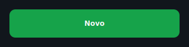

| Prop | Type | Default | Description |
|---|---|---|---|
| `label` | `str` | `""` | Badge text (e.g. `"3"`, `"NEW"`). |
| `tone` | `str` | `"error"` | Background color: `"info"` / `"success"` / `"warning"` / `"error"`. |

---

### Accordion

A controlled expand/collapse section. The `open` state lives in the app;
tapping the header calls `on_toggle` to flip it.

```python
from tempestroid import Accordion, Text

Accordion(
    title="Technical details",
    open=app.state.details_open,
    on_toggle=lambda: app.set_state(lambda s: setattr(s, "details_open", not s.details_open)),
    children=[
        Text(content="Version: 1.0.0", key="ver"),
        Text(content="Platform: Android 15", key="plat"),
    ],
    key="acc",
)
```

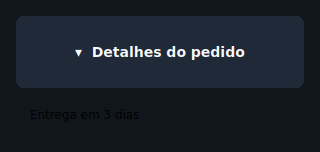

| Prop | Type | Default | Description |
|---|---|---|---|
| `title` | `str` | `""` | Header text. |
| `open` | `bool` | `False` | Controls whether the body is expanded. |
| `children` | `list[Widget]` | `[]` | Widgets revealed when open. |
| `on_toggle` | `handler` | — | Called when the header is tapped. **Required.** |

---

## Date and time

### Calendar

A monthly grid of selectable day cells. The month is provided as `"YYYY-MM"`;
the selected day as `"YYYY-MM-DD"`. Omitting `month` displays the current month.

```python
from tempestroid import Calendar

Calendar(
    month="2026-06",
    selected=app.state.date,
    on_select=lambda d: app.set_state(lambda s: setattr(s, "date", d)),
    key="cal",
)
```

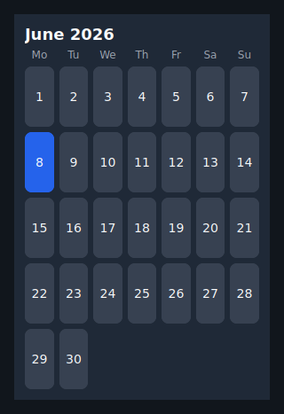

| Prop | Type | Default | Description |
|---|---|---|---|
| `month` | `str` | `""` | Displayed month as `"YYYY-MM"` (empty = current month). |
| `selected` | `str` | `""` | Selected day as `"YYYY-MM-DD"` (empty = no selection). |
| `on_select` | `handler → str` | — | Called with the tapped day's ISO date string. **Required.** |

---

### Clock

Digital clock face that renders a pre-formatted time string. The app formats
and ticks the clock through state (see the `stopwatch` example).

```python
from tempestroid import Clock

Clock(
    time=app.state.time_str,   # e.g. "12:34:56"
    label="UTC-3",
    key="clock",
)
```

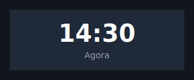

| Prop | Type | Default | Description |
|---|---|---|---|
| `time` | `str` | `""` | Time string to display (e.g. `"12:34:56"`). |
| `label` | `str \| None` | `None` | Optional muted caption below the time. |

---

## Tables

### Table

Static data table of typed rows. Each row is a `TableRow` holding `TableCell`
values. Optional headers are rendered in bold in the first row.

```python
from tempestroid import Table, TableCell, TableRow

Table(
    headers=["Name", "Role", "Status"],
    rows=[
        TableRow(cells=[
            TableCell(content="Alice"),
            TableCell(content="Engineer"),
            TableCell(content="Active"),
        ]),
        TableRow(cells=[
            TableCell(content="Bob"),
            TableCell(content="Designer"),
            TableCell(content="On leave"),
        ]),
    ],
    key="team-table",
)
```

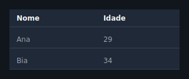

| Prop | Type | Default | Description |
|---|---|---|---|
| `rows` | `list[TableRow]` | `[]` | Body rows, each holding `TableCell` values. |
| `headers` | `list[str]` | `[]` | Header row labels (bold). |

---

### DataTable

Convenience string-matrix table. Provide `columns` and `rows` as lists of
strings; use `sortable=True` to append the ▾ glyph to headers (actual sorting
is done by the app reordering `rows`).

```python
from tempestroid import DataTable

DataTable(
    columns=["Product", "Price", "Stock"],
    rows=[
        ["Notebook Pro", "$4,999", "12"],
        ["Ergonomic Mouse", "$299", "87"],
    ],
    sortable=True,
    key="products-dt",
)
```

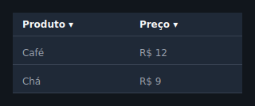

| Prop | Type | Default | Description |
|---|---|---|---|
| `columns` | `list[str]` | `[]` | Column header labels. |
| `rows` | `list[list[str]]` | `[]` | Body rows as a string matrix. |
| `sortable` | `bool` | `False` | When `True`, appends ▾ to headers to indicate sortability. |

---

## Brazilian form inputs

These components lower to the `Input` / `MaskedInput` primitives wrapped in a
labelled `Column` (optional label above, the field, and an optional red error
line below). Each one exposes an `on_change` that receives the **new string
value** — you never touch the event object. Pair each field with the matching
validator from `tempestroid.validators` for per-field validation inside a
`Form`: pass the component as the `child` of a `FormField` with the right
`validators` list, and the `Form` aggregates the errors and blocks an invalid
submit before any patch.

!!! info "Ready-made validators"
    `tempestroid.validators` ships `validate_cpf`, `validate_cnpj`,
    `validate_email`, and `validate_phone` — pure
    `Callable[[Any], str | None]` functions that return a PT-BR message when the
    value is invalid or `None` when valid. They strip mask characters (dots,
    dashes, parentheses) before validating, so `"123.456.789-09"` validates the
    same as its bare digits.

### EmailInput

A labelled e-mail field with the e-mail keyboard, a `mail` icon, and a built-in
`pattern` (`EMAIL_PATTERN`).

```python
from tempestroid import EmailInput, FormField, validate_email

FormField(
    name="email",
    validators=[validate_email],
    child=EmailInput(
        value=app.state.email,
        on_change=lambda v: app.set_state(lambda s: setattr(s, "email", v)),
        key="email",
    ),
    key="email-field",
)
```

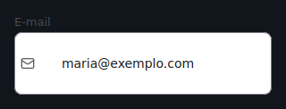

`EMAIL` keyboard; validate with `validate_email`.

### PasswordInput

A secure password field (masked, with the built-in eye toggle) and a `lock`
icon.

```python
from tempestroid import FormField, PasswordInput

FormField(
    name="password",
    child=PasswordInput(
        value=app.state.password,
        on_change=lambda v: app.set_state(lambda s: setattr(s, "password", v)),
        key="password",
    ),
    key="password-field",
)
```

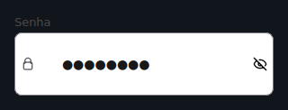

Secure field (`secure=True`); no mask — pair it with your own strength validator
if you want one.

### PhoneInput

A Brazilian phone field, masked `(99) 99999-9999`.

```python
from tempestroid import FormField, PhoneInput, validate_phone

FormField(
    name="phone",
    validators=[validate_phone],
    child=PhoneInput(
        value=app.state.phone,
        on_change=lambda v: app.set_state(lambda s: setattr(s, "phone", v)),
        key="phone",
    ),
    key="phone-field",
)
```

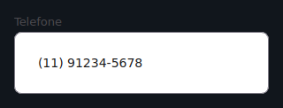

Mask `(99) 99999-9999`, `PHONE` keyboard; validate with `validate_phone`
(accepts 10 or 11 digits).

### CPFInput

A CPF field, masked `999.999.999-99`.

```python
from tempestroid import CPFInput, FormField, validate_cpf

FormField(
    name="cpf",
    validators=[validate_cpf],
    child=CPFInput(
        value=app.state.cpf,
        on_change=lambda v: app.set_state(lambda s: setattr(s, "cpf", v)),
        key="cpf",
    ),
    key="cpf-field",
)
```

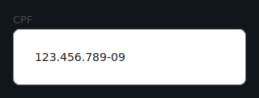

Mask `999.999.999-99`, `NUMBER` keyboard; validate with `validate_cpf`
(11 digits + check digits).

### CNPJInput

A CNPJ field, masked `99.999.999/9999-99`.

```python
from tempestroid import CNPJInput, FormField, validate_cnpj

FormField(
    name="cnpj",
    validators=[validate_cnpj],
    child=CNPJInput(
        value=app.state.cnpj,
        on_change=lambda v: app.set_state(lambda s: setattr(s, "cnpj", v)),
        key="cnpj",
    ),
    key="cnpj-field",
)
```

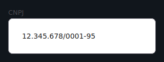

Mask `99.999.999/9999-99`, `NUMBER` keyboard; validate with `validate_cnpj`
(14 digits + check digits).

### AddressInput

A grouped Brazilian address block: CEP (masked `99999-999`), street, number,
complement, neighborhood, city, and UF. A single `on_change(field_name,
new_value)` is called for whichever field changed, where `field_name` is
`"cep"`, `"street"`, `"number"`, `"complement"`, `"neighborhood"`, `"city"`, or
`"state"`.

```python
from tempestroid import AddressInput

AddressInput(
    cep=app.state.cep,
    street=app.state.street,
    city=app.state.city,
    state=app.state.uf,
    on_change=lambda field, value: app.set_state(
        lambda s: setattr(s, field, value)
    ),
    key="address",
)
```

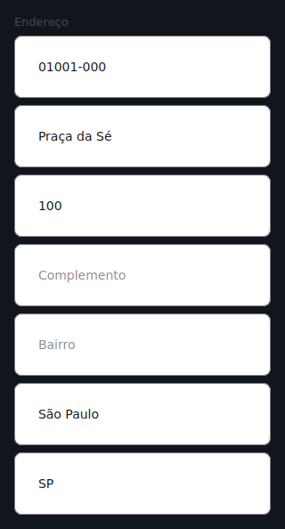

CEP is masked `99999-999` (`NUMBER` keyboard); the remaining fields are plain
`Input`s. No built-in validator — validate each field in the app as needed.

---

## Media inputs

These components lower to the `FilePicker` and `Image` primitives. Each one
exposes an `on_pick` that receives the picked file's **URI** (from
`FileSelectEvent.uri`) — you never touch the event object.

### ImagePicker

An image picker with an inline preview of the chosen image (a `FilePicker` plus
an `Image` preview when a URI is set).

```python
from tempestroid import ImagePicker

ImagePicker(
    value=app.state.image_uri,
    label="Product photo",
    on_pick=lambda uri: app.set_state(lambda s: setattr(s, "image_uri", uri)),
    key="image-picker",
)
```

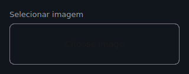

| Prop | Type | Default | Description |
|---|---|---|---|
| `value` | `str` | `""` | URI of the chosen image (empty = no preview). |
| `label` | `str` | `""` | Optional heading above the picker. |
| `on_pick` | `handler → str` | — | Called with the picked URI. **Required.** |

### DocumentPicker

A labelled document picker (just the `FilePicker`, no preview).

```python
from tempestroid import DocumentPicker

DocumentPicker(
    value=app.state.doc_uri,
    label="Receipt",
    on_pick=lambda uri: app.set_state(lambda s: setattr(s, "doc_uri", uri)),
    key="doc-picker",
)
```

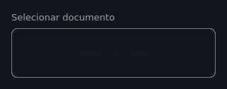

| Prop | Type | Default | Description |
|---|---|---|---|
| `value` | `str` | `""` | URI of the chosen document. |
| `label` | `str` | `""` | Optional heading above the picker. |
| `on_pick` | `handler → str` | — | Called with the picked URI. **Required.** |

### ImagePicture

A circular profile photo: the chosen photo clipped to a circle (or a `user`
icon placeholder) over a change button. Distinct from `Avatar`, which shows
initials.

```python
from tempestroid import ImagePicture

ImagePicture(
    src=app.state.photo_uri,
    size=120.0,
    on_pick=lambda uri: app.set_state(lambda s: setattr(s, "photo_uri", uri)),
    key="profile-photo",
)
```

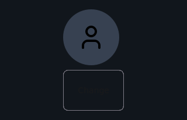

| Prop | Type | Default | Description |
|---|---|---|---|
| `src` | `str` | `""` | URI of the current photo (empty shows the placeholder). |
| `size` | `float` | `96.0` | Circle diameter in logical pixels. |
| `on_pick` | `handler → str` | — | Called with the picked URI. **Required.** |

---

## Recap

- Components extend `Component` and implement `render()`, which returns a
  primitive subtree — no extra code in the renderers.
- Always import from `from tempestroid import ...` — never from submodules.
- `Scaffold` is the starting point for a screen: compose `AppBar` + content +
  `NavBar` in a single widget.
- **Controlled** components (`Drawer`, `Accordion`, `NavBar`, `Calendar`…)
  expose `open`/`active`/`selected` as props — the state lives in the app.
- For simple tables use `DataTable`; for cells with custom styles use
  `Table` + `TableRow` + `TableCell`.
- `Badge`, `Banner`, and `EmptyState` use the `"info"`, `"success"`,
  `"warning"`, and `"error"` tones for semantic colorization.

## Next steps

➡️ See how to combine these components in complete apps in the
**[Examples gallery](../exemplos.md)**, or explore
**[Styles](../estilos.md)** to customize the look of any component via the
`style` prop.
