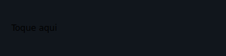
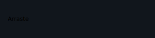
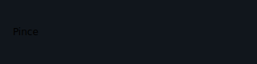
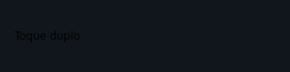
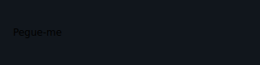
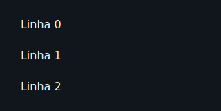

# Gesture widgets

Gesture widgets are single-child wrappers (or a child-list wrapper in the case
of `ReorderableList`) that detect touch interactions — pan, drag, pinch, double
tap, swipe, and reorder — and emit a typed event that the handler turns into
state. They compose over the existing layout primitives: just wrap any widget
to add gesture behaviour without changing its appearance.

All widgets in this family are supported by **both renderers** — the Qt desktop
simulator and Compose on device — with the same API; swipe-to-delete and
reorder were verified on both renderers, and pinch-zoom was verified on device.

---

## GestureDetector

Single-child wrapper that reports a tap, double tap, long press, and swipe
directly over its child's hit area.

```python
from tempestroid import (
    Container,
    GestureDetector,
    LongPressEvent,
    Style,
    SwipeEvent,
    TapEvent,
    Text,
)


async def on_tap(e: TapEvent) -> None:
    app.set_state(lambda s: setattr(s, "msg", "tapped"))


async def on_long(e: LongPressEvent) -> None:
    app.set_state(lambda s: setattr(s, "msg", "long press"))


async def on_swipe(e: SwipeEvent) -> None:
    app.set_state(lambda s: setattr(s, "msg", f"swipe {e.direction}"))


GestureDetector(
    on_tap=on_tap,
    on_long_press=on_long,
    on_swipe=on_swipe,
    child=Container(
        style=Style(padding=24.0, background="#E3F2FD", border_radius=12.0),
        child=Text(content="Tap or swipe here", key="label"),
    ),
    key="detector",
)
```



| Prop | Type | Default | Description |
|---|---|---|---|
| `child` | `Widget \| None` | `None` | Single child over which gestures are detected. |
| `on_tap` | `handler → TapEvent` | `None` | Single tap. `TapEvent` has `x: float \| None` and `y: float \| None` with the touch position. |
| `on_double_tap` | `handler → TapEvent` | `None` | Double tap. Emits the same `TapEvent`. |
| `on_long_press` | `handler → LongPressEvent` | `None` | Sustained press. `LongPressEvent` has `x: float \| None` and `y: float \| None`. |
| `on_swipe` | `handler → SwipeEvent` | `None` | Swipe in any direction. `SwipeEvent` has `direction: str` (`"left"`, `"right"`, `"up"`, `"down"`). |

---

## PanHandler

Single-child wrapper that reports a continuous pan gesture (drag without
releasing), useful for moving objects on screen or building custom scroll
behaviour.

```python
from tempestroid import Container, PanEvent, PanHandler, Style, Text


async def on_pan(e: PanEvent) -> None:
    app.set_state(
        lambda s: setattr(s, "offset", (s.offset[0] + e.delta_x, s.offset[1] + e.delta_y))
    )


PanHandler(
    on_pan=on_pan,
    child=Container(
        style=Style(padding=20.0, background="#FFF9C4", border_radius=8.0),
        child=Text(content="Drag me", key="lbl"),
    ),
    key="pan",
)
```



| Prop | Type | Default | Description |
|---|---|---|---|
| `child` | `Widget \| None` | `None` | Single child to monitor. |
| `on_pan` | `handler → PanEvent` | `None` | Called continuously during the pan. `PanEvent` has `delta_x: float`, `delta_y: float` (displacement since the last event) and `state: str` (`"start"`, `"update"`, `"end"`). |

---

## ScaleHandler

Single-child wrapper that reports pinch-to-zoom and rotation, plus a double
tap as a zoom shortcut.

```python
from tempestroid import Container, ScaleEvent, ScaleHandler, Style, TapEvent, Text


async def on_scale(e: ScaleEvent) -> None:
    app.set_state(lambda s: setattr(s, "zoom", s.zoom * e.scale))


async def on_double_tap(e: TapEvent) -> None:
    app.set_state(lambda s: setattr(s, "zoom", 1.0))


ScaleHandler(
    on_scale=on_scale,
    on_double_tap=on_double_tap,
    child=Container(
        style=Style(padding=32.0, background="#F3E5F5", border_radius=8.0),
        child=Text(content="Pinch to zoom", key="lbl"),
    ),
    key="scale",
)
```



| Prop | Type | Default | Description |
|---|---|---|---|
| `child` | `Widget \| None` | `None` | Single child to monitor. |
| `on_scale` | `handler → ScaleEvent` | `None` | Called during the pinch gesture. `ScaleEvent` has `scale: float` (cumulative factor), `rotation: float` (degrees) and `state: str` (`"start"`, `"update"`, `"end"`). |
| `on_double_tap` | `handler → TapEvent` | `None` | Double tap over the child's area (convenient for resetting zoom). |

---

## DoubleTapHandler

Single-child wrapper focused exclusively on double tap — lighter than
`GestureDetector` when no other gestures are needed.

```python
from tempestroid import Container, DoubleTapHandler, Style, TapEvent, Text


async def on_double(e: TapEvent) -> None:
    app.set_state(lambda s: setattr(s, "liked", not s.liked))


DoubleTapHandler(
    on_double_tap=on_double,
    child=Container(
        style=Style(padding=16.0, background="#FCE4EC", border_radius=8.0),
        child=Text(content="Double tap to like", key="lbl"),
    ),
    key="dtap",
)
```



| Prop | Type | Default | Description |
|---|---|---|---|
| `child` | `Widget \| None` | `None` | Single child to monitor. |
| `on_double_tap` | `handler → TapEvent` | `None` | Rapid double tap. `TapEvent` has `x: float \| None` and `y: float \| None`. |

---

## Draggable

Makes the child draggable. When a drag starts, the runtime carries `drag_data`
which will be delivered to the `DragTarget` on drop.

```python
from tempestroid import Container, DragEvent, Draggable, Style, Text


async def on_drag(e: DragEvent) -> None:
    app.set_state(lambda s: setattr(s, "dragging", e.state == "start"))


Draggable(
    drag_data="card-1",
    on_drag=on_drag,
    child=Container(
        style=Style(padding=16.0, background="#E8F5E9", border_radius=8.0),
        child=Text(content="Drag me to the target", key="lbl"),
    ),
    key="drag",
)
```



| Prop | Type | Default | Description |
|---|---|---|---|
| `child` | `Widget \| None` | `None` | Single child that will be dragged. |
| `drag_data` | `str` | `""` | Opaque string delivered to `DragTarget.on_drop` as `DragEvent.data`. |
| `on_drag` | `handler → DragEvent` | `None` | Called on drag state changes. `DragEvent` has `data: str` and `state: str` (`"start"`, `"update"`, `"end"`). |

---

## DragTarget

Drop zone that accepts a `Draggable` released over it.

```python
from tempestroid import Container, DragEvent, DragTarget, Style, Text


async def on_drop(e: DragEvent) -> None:
    app.set_state(lambda s: s.items.append(e.data))


DragTarget(
    on_drop=on_drop,
    child=Container(
        style=Style(
            padding=24.0,
            background="#FFF3E0",
            border_radius=8.0,
        ),
        child=Text(content="Drop here", key="lbl"),
    ),
    key="target",
)
```


| Prop | Type | Default | Description |
|---|---|---|---|
| `child` | `Widget \| None` | `None` | Single child representing the drop area. |
| `on_drop` | `handler → DragEvent` | `None` | Called when a `Draggable` is released over this area. `DragEvent` has `data: str` (the `Draggable`'s `drag_data`) and `state: str` (`"end"`). |

!!! tip "Combining Draggable and DragTarget"
    Use `drag_data` to identify which item was dropped. `on_drop` receives
    `DragEvent.data` with that value, so you can update state without relying
    on global variables.

---

## Dismissible

Makes the child dismissible with a lateral swipe (swipe-to-delete). The
`on_dismiss` handler is called when the swipe is completed; remove the item
from state so the reconciler discards it from the tree.

```python
from tempestroid import Column, DismissEvent, Dismissible, Style, SwipeDirection, Text


async def on_dismiss(e: DismissEvent) -> None:
    app.set_state(lambda s: s.items.remove(item_id))


Dismissible(
    direction=SwipeDirection.LEFT,
    on_dismiss=on_dismiss,
    child=Column(
        style=Style(padding=12.0, background="#FAFAFA"),
        children=[
            Text(content="Swipe to remove", key="lbl"),
        ],
    ),
    key=f"item-{item_id}",
)
```


| Prop | Type | Default | Description |
|---|---|---|---|
| `child` | `Widget \| None` | `None` | Single child that can be dismissed. |
| `direction` | `SwipeDirection` | `SwipeDirection.LEFT` | Swipe direction that triggers dismissal. Values: `LEFT`, `RIGHT`. |
| `on_dismiss` | `handler → DismissEvent` | `None` | Called when the swipe completes. `DismissEvent` has `direction: str`. Remove the item from state so the reconciler emits a `Remove` patch. |

!!! warning "You must remove the item from state"
    `Dismissible` does **not** remove the widget from the tree on its own —
    it only notifies. Call `app.set_state` inside `on_dismiss` to remove the
    item from the list; the reconciler will then emit the corresponding
    `Remove` patch.

---

## ReorderableList

Vertical list whose items can be dragged into a new order. `on_reorder`
delivers the source and destination indices; the app rearranges the list in
state and rebuilds the tree.

```python
from tempestroid import ReorderEvent, ReorderableList, Text


async def on_reorder(e: ReorderEvent) -> None:
    def move(s: State) -> None:
        item = s.items.pop(e.old_index)
        s.items.insert(e.new_index, item)

    app.set_state(move)


ReorderableList(
    on_reorder=on_reorder,
    children=[
        Text(content=item, key=item_id)
        for item_id, item in enumerate(app.state.items)
    ],
)
```



| Prop | Type | Default | Description |
|---|---|---|---|
| `children` | `list[Widget]` | `[]` | List items. Use a stable `key` on each child so the reconciler emits a `Reorder` patch instead of recreating widgets. |
| `on_reorder` | `handler → ReorderEvent` | `None` | Called when an item is released at its new position. `ReorderEvent` has `old_index: int` and `new_index: int`. |

!!! tip "Stable keys are essential"
    Give each child of `ReorderableList` a unique, stable `key`. Without keys,
    the reconciler cannot emit an efficient `Reorder` patch and will recreate
    items unnecessarily.

---

## InteractiveViewer

Single-child container that lets the user pan and zoom (pinch + drag) over its
content, with configurable scale limits.

```python
from tempestroid import Container, Image, InteractiveViewer, ScaleEvent, Style


async def on_interaction(e: ScaleEvent) -> None:
    app.set_state(lambda s: setattr(s, "zoom", e.scale))


InteractiveViewer(
    min_scale=0.5,
    max_scale=4.0,
    on_interaction=on_interaction,
    child=Image(
        src="https://example.com/map.jpg",
        alt="Interactive map",
        key="map",
    ),
    key="viewer",
)
```


| Prop | Type | Default | Description |
|---|---|---|---|
| `child` | `Widget \| None` | `None` | Single child over which pan and zoom are applied. |
| `min_scale` | `float` | `0.5` | Minimum allowed scale factor. |
| `max_scale` | `float` | `4.0` | Maximum allowed scale factor. |
| `on_interaction` | `handler → ScaleEvent` | `None` | Called during pan and zoom. `ScaleEvent` has `scale: float`, `rotation: float` and `state: str`. |

!!! info "Pinch-zoom verified on device"
    The real pinch gesture was verified on an arm64 device (Xiaomi 23053RN02A,
    Android 15). In the Qt simulator, zoom is simulated with scroll wheel +
    `Ctrl`.

---

## Recap

- **`GestureDetector`** — multi-gesture wrapper: tap, double tap, long press,
  and swipe in any direction.
- **`PanHandler`** — continuous pan with `delta_x`/`delta_y` on every gesture
  frame.
- **`ScaleHandler`** — pinch-to-zoom and rotation via `ScaleEvent`; double tap
  as a zoom shortcut.
- **`DoubleTapHandler`** — isolated double tap, lighter than `GestureDetector`
  when that is the only gesture needed.
- **`Draggable`** / **`DragTarget`** — drag-and-drop pair: `drag_data` identifies
  the item; `DragEvent.data` delivers it to the target.
- **`Dismissible`** — swipe-to-delete; always remove the item from state in
  `on_dismiss` so the reconciler emits a `Remove` patch.
- **`ReorderableList`** — drag-to-reorder; `ReorderEvent` provides `old_index`
  and `new_index`; use a stable `key` on every child.
- **`InteractiveViewer`** — pan + zoom on a single child with `min_scale` /
  `max_scale` limits; pinch-zoom verified on device.

Next steps: explore overlays and feedback on the **[Overlays](overlays.md)**
page, see advanced inputs on **[Inputs](inputs.md)**, or browse complete apps
in the **[Examples gallery](../exemplos.md)**.
