# Widgets de Entrada

Widgets de entrada carregam um valor e devolvem o controle ao seu app via um
evento de mudança tipado. Cada widget desse grupo chama `app.set_state(...)` no
*handler*, fechando o ciclo dados → UI → dados. O *payload* do evento é sempre
validado antes de chegar ao *handler* — da mesma forma que o FastAPI valida
corpos de requisição.

> Ambos os renderizadores — **simulador Qt** (desktop) e **Compose no
> dispositivo** (Android arm64) — renderizam esses inputs nativamente.

---

## Input

Campo de texto de uma única linha. Suporta senha, teclado específico, máscara de
erro e limite de caracteres.

```python
from dataclasses import dataclass
from tempestroid import App, Column, Input, KeyboardType, Text, TextChangeEvent


@dataclass
class State:
    email: str = ""
    password: str = ""


def view(app: App) -> Column:
    state = app.state

    def on_email(event: TextChangeEvent) -> None:
        app.set_state(lambda s: setattr(s, "email", event.value))

    def on_password(event: TextChangeEvent) -> None:
        app.set_state(lambda s: setattr(s, "password", event.value))

    return Column(
        children=[
            Input(
                value=state.email,
                placeholder="seu@email.com",
                keyboard=KeyboardType.EMAIL,
                key="email",
                on_change=on_email,
            ),
            Input(
                value=state.password,
                placeholder="Senha",
                secure=True,
                on_change=on_password,
                key="pwd",
            ),
            Text(content=f"Email: {state.email}", key="preview"),
        ]
    )


def make_state() -> State:
    return State()
```

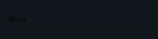

| Prop | Tipo | Padrão | Descrição |
|---|---|---|---|
| `value` | `str` | `""` | Conteúdo atual do campo. |
| `placeholder` | `str` | `""` | Texto de dica exibido quando vazio. |
| `secure` | `bool` | `False` | Mascara o texto (modo senha). |
| `pattern` | `str \| None` | `None` | Regex de validação; `TextChangeEvent.valid` reflete o resultado. |
| `error` | `str` | `""` | Mensagem de erro exibida abaixo do campo. |
| `keyboard` | `KeyboardType` | `KeyboardType.TEXT` | Tipo de teclado sugerido ao dispositivo (`TEXT`, `NUMBER`, `EMAIL`, `PHONE`, `URL`, `PASSWORD`). |
| `max_length` | `int \| None` | `None` | Número máximo de caracteres permitidos. |
| `on_change` | handler → `TextChangeEvent` | `None` | Chamado a cada mudança de texto. Recebe `TextChangeEvent(value, valid)`. |

---

## TextArea

Campo de texto de múltiplas linhas — ideal para comentários, bios e notas.

```python
from dataclasses import dataclass
from tempestroid import App, Column, Text, TextArea, TextChangeEvent


@dataclass
class State:
    bio: str = ""


def view(app: App) -> Column:
    state = app.state

    def on_bio(event: TextChangeEvent) -> None:
        app.set_state(lambda s: setattr(s, "bio", event.value))

    return Column(
        children=[
            TextArea(
                value=state.bio,
                placeholder="Escreva sua bio…",
                rows=4,
                max_length=280,
                on_change=on_bio,
                key="bio",
            ),
            Text(content=f"{len(state.bio)}/280", key="counter"),
        ]
    )


def make_state() -> State:
    return State()
```

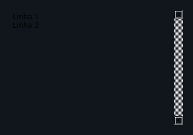

| Prop | Tipo | Padrão | Descrição |
|---|---|---|---|
| `value` | `str` | `""` | Conteúdo atual. |
| `placeholder` | `str` | `""` | Texto de dica. |
| `rows` | `int` | `3` | Altura mínima em linhas visíveis. |
| `max_length` | `int \| None` | `None` | Limite de caracteres. |
| `on_change` | handler → `TextChangeEvent` | `None` | Chamado a cada mudança. Recebe `TextChangeEvent(value, valid)`. |

---

## Checkbox

Caixa de seleção booleana com rótulo.

```python
from dataclasses import dataclass
from tempestroid import App, Checkbox, Column, Text, ToggleEvent


@dataclass
class State:
    aceito: bool = False


def view(app: App) -> Column:
    state = app.state

    def on_toggle(event: ToggleEvent) -> None:
        app.set_state(lambda s: setattr(s, "aceito", event.checked))

    return Column(
        children=[
            Checkbox(
                label="Aceito os termos de uso",
                checked=state.aceito,
                on_change=on_toggle,
                key="terms",
            ),
            Text(content="Aceito!" if state.aceito else "Pendente…", key="status"),
        ]
    )


def make_state() -> State:
    return State()
```

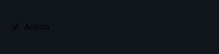

| Prop | Tipo | Padrão | Descrição |
|---|---|---|---|
| `label` | `str` | `""` | Rótulo exibido ao lado da caixa. |
| `checked` | `bool` | `False` | Estado atual. |
| `on_change` | handler → `ToggleEvent` | `None` | Chamado quando o usuário alterna. Recebe `ToggleEvent(checked)`. |

---

## Switch

Interruptor on/off com rótulo. Usa a mesma lógica de evento que `Checkbox`.

```python
from dataclasses import dataclass
from tempestroid import App, Column, Switch, Text, ToggleEvent


@dataclass
class State:
    notificacoes: bool = True


def view(app: App) -> Column:
    state = app.state

    def on_switch(event: ToggleEvent) -> None:
        app.set_state(lambda s: setattr(s, "notificacoes", event.checked))

    return Column(
        children=[
            Switch(
                label="Receber notificações",
                checked=state.notificacoes,
                on_change=on_switch,
                key="notif",
            ),
            Text(content="Ligado" if state.notificacoes else "Desligado", key="label"),
        ]
    )


def make_state() -> State:
    return State()
```


| Prop | Tipo | Padrão | Descrição |
|---|---|---|---|
| `label` | `str` | `""` | Rótulo exibido ao lado do interruptor. |
| `checked` | `bool` | `False` | Estado atual. |
| `on_change` | handler → `ToggleEvent` | `None` | Chamado quando o usuário alterna. Recebe `ToggleEvent(checked)`. |

---

## Slider

Controle deslizante de um único valor sobre uma faixa numérica.

```python
from dataclasses import dataclass
from tempestroid import App, Column, Slider, SlideEvent, Text


@dataclass
class State:
    volume: float = 50.0


def view(app: App) -> Column:
    state = app.state

    def on_slide(event: SlideEvent) -> None:
        app.set_state(lambda s: setattr(s, "volume", event.value))

    return Column(
        children=[
            Slider(
                value=state.volume,
                min_value=0.0,
                max_value=100.0,
                step=1.0,
                on_change=on_slide,
                key="vol",
            ),
            Text(content=f"Volume: {int(state.volume)}", key="label"),
        ]
    )


def make_state() -> State:
    return State()
```

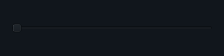

| Prop | Tipo | Padrão | Descrição |
|---|---|---|---|
| `value` | `float` | `0.0` | Valor atual. |
| `min_value` | `float` | `0.0` | Limite inferior. |
| `max_value` | `float` | `100.0` | Limite superior. |
| `step` | `float` | `1.0` | Incremento mínimo de cada passo. |
| `on_change` | handler → `SlideEvent` | `None` | Chamado a cada movimento. Recebe `SlideEvent(value)`. |

---

## RangeSlider

Controle deslizante com dois identificadores — define uma sub-faixa `[low, high]`.

```python
from dataclasses import dataclass
from tempestroid import App, Column, RangeChangeEvent, RangeSlider, Text


@dataclass
class State:
    preco_min: float = 20.0
    preco_max: float = 80.0


def view(app: App) -> Column:
    state = app.state

    def on_range(event: RangeChangeEvent) -> None:
        app.set_state(lambda s: (
            setattr(s, "preco_min", event.low) or
            setattr(s, "preco_max", event.high)
        ))

    return Column(
        children=[
            RangeSlider(
                low=state.preco_min,
                high=state.preco_max,
                min_value=0.0,
                max_value=100.0,
                step=1.0,
                on_change=on_range,
                key="preco",
            ),
            Text(
                content=f"R$ {state.preco_min:.0f} – R$ {state.preco_max:.0f}",
                key="label",
            ),
        ]
    )


def make_state() -> State:
    return State()
```

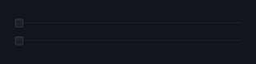

| Prop | Tipo | Padrão | Descrição |
|---|---|---|---|
| `low` | `float` | `0.0` | Valor do identificador inferior. |
| `high` | `float` | `100.0` | Valor do identificador superior. |
| `min_value` | `float` | `0.0` | Limite mínimo da faixa. |
| `max_value` | `float` | `100.0` | Limite máximo da faixa. |
| `step` | `float` | `1.0` | Incremento mínimo. |
| `on_change` | handler → `RangeChangeEvent` | `None` | Chamado a cada movimento. Recebe `RangeChangeEvent(low, high)`. |

---

## Dropdown

Seletor de uma única opção em uma lista suspensa.

```python
from dataclasses import dataclass
from tempestroid import App, Column, Dropdown, SelectEvent, Text


@dataclass
class State:
    pais: str | None = None


def view(app: App) -> Column:
    state = app.state

    def on_select(event: SelectEvent) -> None:
        app.set_state(lambda s: setattr(s, "pais", event.value))

    return Column(
        children=[
            Dropdown(
                options=["Brasil", "Argentina", "Chile", "Colômbia"],
                value=state.pais,
                placeholder="Selecione um país…",
                on_select=on_select,
                key="pais",
            ),
            Text(
                content=f"País: {state.pais or '—'}",
                key="label",
            ),
        ]
    )


def make_state() -> State:
    return State()
```

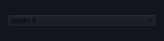

| Prop | Tipo | Padrão | Descrição |
|---|---|---|---|
| `options` | `list[str]` | `[]` | Lista de opções disponíveis. |
| `value` | `str \| None` | `None` | Opção atualmente selecionada. |
| `placeholder` | `str` | `"Select…"` | Texto exibido quando nenhuma opção está selecionada. |
| `on_select` | handler → `SelectEvent` | `None` | Chamado quando o usuário escolhe uma opção. Recebe `SelectEvent(value, index)`. |

---

## DatePicker

Campo de seleção de data. O valor é uma string ISO `yyyy-mm-dd`.

```python
from dataclasses import dataclass
from tempestroid import App, Column, DateChangeEvent, DatePicker, Text


@dataclass
class State:
    nascimento: str = ""


def view(app: App) -> Column:
    state = app.state

    def on_date(event: DateChangeEvent) -> None:
        app.set_state(lambda s: setattr(s, "nascimento", event.value))

    return Column(
        children=[
            DatePicker(
                value=state.nascimento,
                label="Data de nascimento",
                on_change=on_date,
                key="nasc",
            ),
            Text(content=f"Nascimento: {state.nascimento or '—'}", key="label"),
        ]
    )


def make_state() -> State:
    return State()
```

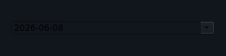

| Prop | Tipo | Padrão | Descrição |
|---|---|---|---|
| `value` | `str` | `""` | Data selecionada em formato ISO (`yyyy-mm-dd`). |
| `label` | `str` | `""` | Rótulo exibido acima do campo. |
| `on_change` | handler → `DateChangeEvent` | `None` | Chamado ao selecionar uma data. Recebe `DateChangeEvent(value)`. |

---

## TimePicker

Campo de seleção de hora no formato `HH:mm`.

```python
from dataclasses import dataclass
from tempestroid import App, Column, Text, TimeChangeEvent, TimePicker


@dataclass
class State:
    horario: str = ""


def view(app: App) -> Column:
    state = app.state

    def on_time(event: TimeChangeEvent) -> None:
        app.set_state(lambda s: setattr(s, "horario", event.value))

    return Column(
        children=[
            TimePicker(
                value=state.horario,
                label="Horário da reunião",
                on_change=on_time,
                key="hora",
            ),
            Text(content=f"Horário: {state.horario or '—'}", key="label"),
        ]
    )


def make_state() -> State:
    return State()
```

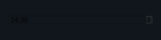

| Prop | Tipo | Padrão | Descrição |
|---|---|---|---|
| `value` | `str` | `""` | Hora selecionada no formato `HH:mm`. |
| `label` | `str` | `""` | Rótulo exibido acima do campo. |
| `on_change` | handler → `TimeChangeEvent` | `None` | Chamado ao alterar a hora. Recebe `TimeChangeEvent(value)`. |

---

## FilePicker

Botão que abre o seletor de arquivos da plataforma. Ao selecionar, retorna o URI
e o nome do arquivo.

```python
from dataclasses import dataclass
from tempestroid import App, Column, FilePicker, FileSelectEvent, Text


@dataclass
class State:
    arquivo: str = ""


def view(app: App) -> Column:
    state = app.state

    def on_pick(event: FileSelectEvent) -> None:
        app.set_state(lambda s: setattr(s, "arquivo", event.name or event.uri))

    return Column(
        children=[
            FilePicker(
                label="Escolher arquivo",
                value=state.arquivo,
                on_select=on_pick,
                key="fp",
            ),
            Text(content=f"Arquivo: {state.arquivo or '—'}", key="label"),
        ]
    )


def make_state() -> State:
    return State()
```

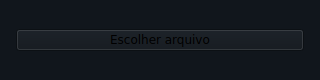

| Prop | Tipo | Padrão | Descrição |
|---|---|---|---|
| `label` | `str` | `"Choose file"` | Rótulo do botão. |
| `value` | `str` | `""` | Caminho/nome do arquivo atualmente selecionado. |
| `on_select` | handler → `FileSelectEvent` | `None` | Chamado após a seleção. Recebe `FileSelectEvent(uri, name)`. |

---

## PinInput

Entrada segmentada de PIN / OTP com células individuais. O foco avança
automaticamente para a próxima célula a cada caractere digitado.

!!! tip "Avanço automático de foco"
    Cada célula aceita exatamente um caractere. Ao preencher uma célula, o
    foco passa automaticamente para a próxima — o usuário não precisa tocar
    em cada célula separadamente.

```python
from dataclasses import dataclass
from tempestroid import App, Column, PinInput, SubmitEvent, Text, TextChangeEvent


@dataclass
class State:
    pin: str = ""
    completo: bool = False


def view(app: App) -> Column:
    state = app.state

    def on_change(event: TextChangeEvent) -> None:
        app.set_state(lambda s: setattr(s, "pin", event.value))

    def on_complete(event: SubmitEvent) -> None:
        app.set_state(lambda s: setattr(s, "completo", True))

    return Column(
        children=[
            PinInput(
                length=6,
                value=state.pin,
                secure=False,
                on_change=on_change,
                on_complete=on_complete,
                key="pin",
            ),
            Text(
                content="PIN completo!" if state.completo else f"Digitado: {len(state.pin)}/6",
                key="status",
            ),
        ]
    )


def make_state() -> State:
    return State()
```

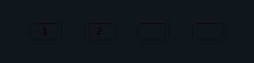

| Prop | Tipo | Padrão | Descrição |
|---|---|---|---|
| `length` | `int` | `6` | Número de células (dígitos). |
| `value` | `str` | `""` | Conteúdo atual (concatenação dos dígitos). |
| `secure` | `bool` | `False` | Mascara os dígitos como pontos. |
| `on_change` | handler → `TextChangeEvent` | `None` | Chamado a cada célula preenchida. Recebe `TextChangeEvent(value, valid)`. |
| `on_complete` | handler → `SubmitEvent` | `None` | Chamado quando todas as células estão preenchidas. Recebe `SubmitEvent`. |

---

## MaskedInput

Campo de texto com máscara que restringe e formata a entrada enquanto o usuário
digita — útil para CPF, telefone, cartão de crédito etc.

!!! info "Caracteres de máscara"
    - `9` — aceita qualquer dígito (`0–9`).
    - `A` — aceita qualquer letra (`a–z`, `A–Z`).
    - Outros caracteres são literais (ex.: `/`, `-`, `(`, `)`) e são inseridos
      automaticamente à medida que o usuário digita.

```python
from dataclasses import dataclass
from tempestroid import App, Column, KeyboardType, MaskedInput, Text, TextChangeEvent


@dataclass
class State:
    cpf: str = ""


def view(app: App) -> Column:
    state = app.state

    def on_cpf(event: TextChangeEvent) -> None:
        app.set_state(lambda s: setattr(s, "cpf", event.value))

    return Column(
        children=[
            MaskedInput(
                mask="999.999.999-99",
                value=state.cpf,
                placeholder="000.000.000-00",
                keyboard=KeyboardType.NUMBER,
                on_change=on_cpf,
                key="cpf",
            ),
            Text(content=f"CPF: {state.cpf or '—'}", key="label"),
        ]
    )


def make_state() -> State:
    return State()
```

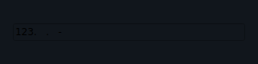

| Prop | Tipo | Padrão | Descrição |
|---|---|---|---|
| `mask` | `str` | `""` | Padrão de máscara (`9` = dígito, `A` = letra, outros = literal). |
| `value` | `str` | `""` | Conteúdo atual (com a máscara aplicada). |
| `placeholder` | `str` | `""` | Texto de dica. |
| `keyboard` | `KeyboardType` | `KeyboardType.TEXT` | Tipo de teclado sugerido ao dispositivo. |
| `on_change` | handler → `TextChangeEvent` | `None` | Chamado a cada mudança. Recebe `TextChangeEvent(value, valid)`. |

---

## Autocomplete

Campo de texto que exibe sugestões a partir de uma lista de opções e permite
selecionar uma delas. Emite dois eventos distintos: um para cada tecla digitada
(`on_change`) e outro ao confirmar uma sugestão (`on_select`).

```python
from dataclasses import dataclass
from tempestroid import App, Autocomplete, Column, SelectEvent, Text, TextChangeEvent


CIDADES = ["São Paulo", "Rio de Janeiro", "Belo Horizonte", "Curitiba", "Salvador"]


@dataclass
class State:
    query: str = ""
    cidade: str = ""


def view(app: App) -> Column:
    state = app.state

    def on_change(event: TextChangeEvent) -> None:
        app.set_state(lambda s: setattr(s, "query", event.value))

    def on_select(event: SelectEvent) -> None:
        app.set_state(lambda s: (
            setattr(s, "cidade", event.value) or
            setattr(s, "query", event.value)
        ))

    return Column(
        children=[
            Autocomplete(
                options=CIDADES,
                value=state.query,
                placeholder="Digite uma cidade…",
                on_change=on_change,
                on_select=on_select,
                key="cidade",
            ),
            Text(content=f"Selecionado: {state.cidade or '—'}", key="label"),
        ]
    )


def make_state() -> State:
    return State()
```

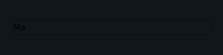

| Prop | Tipo | Padrão | Descrição |
|---|---|---|---|
| `options` | `list[str]` | `[]` | Lista completa de sugestões. |
| `value` | `str` | `""` | Conteúdo atual do campo de texto. |
| `placeholder` | `str` | `""` | Texto de dica. |
| `on_change` | handler → `TextChangeEvent` | `None` | Chamado a cada tecla digitada. Recebe `TextChangeEvent(value, valid)`. |
| `on_select` | handler → `SelectEvent` | `None` | Chamado ao confirmar uma sugestão. Recebe `SelectEvent(value, index)`. |

---

## Form e FormField

`Form` e `FormField` trabalham juntos para validar entradas antes de permitir o
envio. A validação roda em Python — antes dos patches chegarem ao renderizador —
e cada `FormField` exibe seu próprio erro inline.

!!! info "Validação em Python"
    `Form.validate()` chama todos os `validators` de cada `FormField` e retorna
    um `FormState` com os erros por campo. O renderizador só vê o `error` já
    computado — ele nunca toma decisões de validação.

```python
from dataclasses import dataclass, field
from tempestroid import (
    App,
    Button,
    Column,
    Form,
    FormField,
    Input,
    KeyboardType,
    SubmitEvent,
    Text,
    TextChangeEvent,
    ValidationEvent,
)


@dataclass
class State:
    nome: str = ""
    email: str = ""
    nome_error: str = ""
    email_error: str = ""
    enviado: bool = False


def _obrigatorio(value: str) -> str:
    return "Campo obrigatório." if not value.strip() else ""


def _email_valido(value: str) -> str:
    return "E-mail inválido." if "@" not in value else ""


def view(app: App) -> Column:
    state = app.state

    def on_nome(event: TextChangeEvent) -> None:
        app.set_state(lambda s: setattr(s, "nome", event.value))

    def on_email(event: TextChangeEvent) -> None:
        app.set_state(lambda s: setattr(s, "email", event.value))

    def on_submit(event: SubmitEvent) -> None:
        nome_err = _obrigatorio(state.nome)
        email_err = _email_valido(state.email)
        if nome_err or email_err:
            app.set_state(lambda s: (
                setattr(s, "nome_error", nome_err) or
                setattr(s, "email_error", email_err)
            ))
        else:
            app.set_state(lambda s: setattr(s, "enviado", True))

    return Column(
        children=[
            Form(
                fields=[
                    FormField(
                        name="nome",
                        label="Nome completo",
                        error=state.nome_error,
                        child=Input(
                            value=state.nome,
                            placeholder="Seu nome",
                            on_change=on_nome,
                            key="nome-input",
                        ),
                        key="ff-nome",
                    ),
                    FormField(
                        name="email",
                        label="E-mail",
                        error=state.email_error,
                        child=Input(
                            value=state.email,
                            placeholder="seu@email.com",
                            keyboard=KeyboardType.EMAIL,
                            on_change=on_email,
                            key="email-input",
                        ),
                        key="ff-email",
                    ),
                ],
                on_submit=on_submit,
                key="form",
            ),
            Text(
                content="Formulário enviado!" if state.enviado else "",
                key="result",
            ),
        ]
    )


def make_state() -> State:
    return State()
```

### Props de `Form`

| Prop | Tipo | Padrão | Descrição |
|---|---|---|---|
| `fields` | `list[FormField]` | `[]` | Lista de campos do formulário. |
| `on_submit` | handler → `SubmitEvent` | `None` | Chamado quando o usuário dispara o envio. Recebe `SubmitEvent`. |

### Props de `FormField`

| Prop | Tipo | Padrão | Descrição |
|---|---|---|---|
| `name` | `str` | — (obrigatório) | Identificador do campo (usado no `FormState`). |
| `label` | `str` | `""` | Rótulo exibido acima do campo. |
| `error` | `str` | `""` | Mensagem de erro inline; oculta quando vazio. |
| `child` | `Widget \| None` | `None` | O widget de entrada encapsulado. |
| `validators` | handler | `[]` | Lista de funções validadoras chamadas por `Form.validate()`. |
| `on_validate` | handler → `ValidationEvent` | `None` | Chamado ao validar o campo. Recebe `ValidationEvent`. |

---

## Recapitulando

- Widgets de entrada carregam um valor e emitem um evento de mudança tipado —
  `TextChangeEvent`, `ToggleEvent`, `SlideEvent`, `SelectEvent`, etc.
- O *handler* recebe o evento validado e chama `app.set_state(...)`.
- `secure=True` em `Input` e `PinInput` mascara o texto; `keyboard` sugere o
  teclado correto no dispositivo.
- `MaskedInput` usa `9` para dígito e `A` para letra; outros caracteres são
  literais inseridos automaticamente.
- `PinInput` avança o foco automaticamente e dispara `on_complete` quando todas
  as células estão preenchidas.
- `Form` / `FormField` validam em Python antes de patchear o renderizador —
  nunca delegue lógica de validação ao lado nativo.

## Próximos passos

➡️ Veja como compor inputs em formulários reais na
**[Galeria de exemplos](../exemplos.md)**, entenda os **[Eventos](../eventos.md)**
tipados em detalhe, ou explore os widgets de
**[Layout](layout.md)** para estruturar suas telas.
