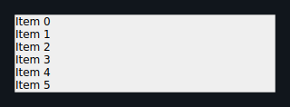
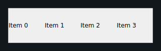
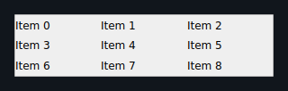
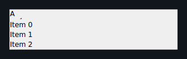
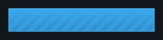

# Listas virtualizadas

Listas virtualizadas permitem exibir coleções de qualquer tamanho sem renderizar
todos os itens de uma vez. O **app** é dono da janela visível: ele mantém um
`window: tuple[int, int]` que delimita os índices materializados, e o reconciliador
faz o *diff* apenas desses filhos. Use `App.slide_window` para avançar a janela a
partir do `ScrollEvent` emitido por `on_scroll`; o sinal `on_end_reached` dispara
um `EndReachedEvent` quando o scroll ultrapassa o limiar `end_reached_threshold`.
Para pull-to-refresh, defina `refreshing=True` enquanto atualiza e use `on_refresh`
para reagir ao gesto — em desktop o overlay de carregamento é exibido pela prop, não
por um gesto nativo.

Ambos os renderizadores — simulador Qt e Compose no dispositivo — suportam esses widgets.

---

## LazyColumn

Lista vertical virtualizada — equivale ao `LazyColumn` do Compose. Renderiza apenas
a janela visível de itens; o `item_builder` é chamado com o índice absoluto para
produzir cada widget filho.

```python
from dataclasses import dataclass
from tempestroid import (
    App, Button, Column, EndReachedEvent, LazyColumn, RefreshEvent,
    Row, ScrollEvent, Style, Text,
)


@dataclass
class State:
    items: list[str]
    refreshing: bool
    window: tuple[int, int]


def make_state() -> State:
    return State(
        items=[f"Item {i}" for i in range(200)],
        refreshing=False,
        window=(0, 20),
    )


def view(app: App[State]) -> Column:
    s = app.state

    def build_item(index: int) -> Row:
        return Row(
            children=[
                Text(content=s.items[index], key="label"),
            ],
            key=str(index),
        )

    async def on_scroll(event: ScrollEvent) -> None:
        new_window = app.slide_window(s.window, event.offset, len(s.items))
        app.set_state(lambda st: setattr(st, "window", new_window))

    async def on_end_reached(event: EndReachedEvent) -> None:
        extra = [f"Item {len(s.items) + i}" for i in range(20)]
        app.set_state(lambda st: setattr(st, "items", st.items + extra))

    async def on_refresh(event: RefreshEvent) -> None:
        app.set_state(lambda st: setattr(st, "refreshing", True))
        # simula busca
        import asyncio
        await asyncio.sleep(1.0)
        fresh = [f"Novo {i}" for i in range(200)]
        app.set_state(lambda st: (
            setattr(st, "items", fresh) or
            setattr(st, "refreshing", False)
        ))

    return Column(
        children=[
            LazyColumn(
                item_count=len(s.items),
                item_builder=build_item,
                window=s.window,
                window_size=20,
                end_reached_threshold=0.8,
                refreshing=s.refreshing,
                on_scroll=on_scroll,
                on_end_reached=on_end_reached,
                on_refresh=on_refresh,
                key="feed",
            ),
        ],
    )
```



| Prop | Tipo | Padrão | Descrição |
|---|---|---|---|
| `item_count` | `int` | — *obrigatório* — | Número total de itens na coleção. |
| `item_builder` | `handler` | — *obrigatório* — | Função `(int) -> Widget` que constrói o item pelo índice. |
| `window_size` | `int` | `20` | Tamanho padrão da janela quando `window` é `None`. |
| `window` | `tuple[int, int] \| None` | `None` | Janela visível `(start, end)` — controlada pelo app via `App.slide_window`. |
| `end_reached_threshold` | `float` | `0.8` | Fração do scroll (0–1) a partir da qual `on_end_reached` é emitido. |
| `refreshing` | `bool` | `False` | Quando `True`, exibe o indicador de carregamento. |
| `on_scroll` | `handler → ScrollEvent` | `None` | Emite `ScrollEvent(offset: float)` a cada evento de scroll. |
| `on_refresh` | `handler → RefreshEvent` | `None` | Emite `RefreshEvent()` quando o usuário puxa para atualizar (somente dispositivo). |
| `on_end_reached` | `handler → EndReachedEvent` | `None` | Emite `EndReachedEvent()` quando o scroll ultrapassa `end_reached_threshold`. |

!!! note "Divergência Qt ↔ Compose"
    No **Qt**, a área de scroll abrange apenas a janela materializada — o scrollbar
    viaja dentro dos itens já construídos. Para avançar além dessa janela, o app
    deve alargar `window` via `App.slide_window`. No **Compose**, o `LazyColumn`
    nativo reporta `layoutInfo` contra o `itemCount` total, scrollando de forma
    virtual. Pull-to-refresh não tem gesto nativo em desktop — o overlay de
    `refreshing=True` é exibido, mas o gesto de arrastar para atualizar só funciona
    no dispositivo.

---

## LazyRow

Lista horizontal virtualizada — equivale ao `LazyRow` do Compose. Mesma mecânica
do `LazyColumn`, mas os itens são dispostos na horizontal.

```python
from dataclasses import dataclass
from tempestroid import (
    App, Column, EndReachedEvent, LazyRow, Row, ScrollEvent, Style, Text,
)


@dataclass
class State:
    chips: list[str]
    window: tuple[int, int]


def make_state() -> State:
    return State(
        chips=[f"Tag {i}" for i in range(50)],
        window=(0, 20),
    )


def view(app: App[State]) -> Column:
    s = app.state

    def build_chip(index: int) -> Text:
        return Text(
            content=s.chips[index],
            style=Style(padding=8.0),
            key=str(index),
        )

    async def on_scroll(event: ScrollEvent) -> None:
        new_window = app.slide_window(s.window, event.offset, len(s.chips))
        app.set_state(lambda st: setattr(st, "window", new_window))

    async def on_end_reached(event: EndReachedEvent) -> None:
        extra = [f"Tag {len(s.chips) + i}" for i in range(10)]
        app.set_state(lambda st: setattr(st, "chips", st.chips + extra))

    return Column(
        children=[
            LazyRow(
                item_count=len(s.chips),
                item_builder=build_chip,
                window=s.window,
                window_size=20,
                end_reached_threshold=0.8,
                on_scroll=on_scroll,
                on_end_reached=on_end_reached,
                key="chips",
            ),
        ],
    )
```



| Prop | Tipo | Padrão | Descrição |
|---|---|---|---|
| `item_count` | `int` | — *obrigatório* — | Número total de itens. |
| `item_builder` | `handler` | — *obrigatório* — | Função `(int) -> Widget` que constrói o item pelo índice. |
| `window_size` | `int` | `20` | Tamanho padrão da janela quando `window` é `None`. |
| `window` | `tuple[int, int] \| None` | `None` | Janela visível `(start, end)`. |
| `end_reached_threshold` | `float` | `0.8` | Fração do scroll a partir da qual `on_end_reached` é emitido. |
| `refreshing` | `bool` | `False` | Exibe indicador de carregamento. |
| `on_scroll` | `handler → ScrollEvent` | `None` | Emite `ScrollEvent(offset: float)` no scroll. |
| `on_refresh` | `handler → RefreshEvent` | `None` | Emite `RefreshEvent()` no gesto de pull (somente dispositivo). |
| `on_end_reached` | `handler → EndReachedEvent` | `None` | Emite `EndReachedEvent()` ao atingir o limiar. |

!!! note "Divergência Qt ↔ Compose"
    As mesmas restrições do `LazyColumn` se aplicam na horizontal: janela
    materializada no Qt, `LazyRow` nativo no Compose. Pull-to-refresh não tem
    gesto em desktop.

---

## LazyGrid

Grade virtualizada — equivale ao `LazyVerticalGrid` do Compose. Os itens são
distribuídos em `columns` colunas; o reconciliador relayout o grid a cada patch
estrutural.

```python
from dataclasses import dataclass
from tempestroid import (
    App, Column, Container, EndReachedEvent, LazyGrid,
    ScrollEvent, Style, Text,
)


@dataclass
class State:
    photos: list[str]
    window: tuple[int, int]


def make_state() -> State:
    return State(
        photos=[f"foto_{i}.jpg" for i in range(120)],
        window=(0, 20),
    )


def view(app: App[State]) -> Column:
    s = app.state

    def build_cell(index: int) -> Container:
        return Container(
            style=Style(
                background="#e0e0e0",
                height=100.0,
                padding=4.0,
            ),
            child=Text(content=s.photos[index], key="name"),
            key=str(index),
        )

    async def on_scroll(event: ScrollEvent) -> None:
        new_window = app.slide_window(s.window, event.offset, len(s.photos))
        app.set_state(lambda st: setattr(st, "window", new_window))

    async def on_end_reached(event: EndReachedEvent) -> None:
        extra = [f"foto_{len(s.photos) + i}.jpg" for i in range(20)]
        app.set_state(lambda st: setattr(st, "photos", st.photos + extra))

    return Column(
        children=[
            LazyGrid(
                item_count=len(s.photos),
                item_builder=build_cell,
                columns=3,
                window=s.window,
                window_size=20,
                end_reached_threshold=0.8,
                on_scroll=on_scroll,
                on_end_reached=on_end_reached,
                key="grid",
            ),
        ],
    )
```



| Prop | Tipo | Padrão | Descrição |
|---|---|---|---|
| `item_count` | `int` | — *obrigatório* — | Total de itens na grade. |
| `item_builder` | `handler` | — *obrigatório* — | Função `(int) -> Widget` que constrói a célula. |
| `columns` | `int` | `2` | Número de colunas. |
| `window_size` | `int` | `20` | Tamanho padrão da janela. |
| `window` | `tuple[int, int] \| None` | `None` | Janela visível `(start, end)`. |
| `end_reached_threshold` | `float` | `0.8` | Fração do scroll para `on_end_reached`. |
| `on_scroll` | `handler → ScrollEvent` | `None` | Emite `ScrollEvent(offset: float)` no scroll. |
| `on_end_reached` | `handler → EndReachedEvent` | `None` | Emite `EndReachedEvent()` ao atingir o limiar. |

!!! note "Divergência Qt ↔ Compose"
    No **Qt**, `LazyGrid` é renderizado num `QGridLayout` de `columns` colunas que é
    relayoutado a cada patch estrutural — o scroll abrange somente a janela
    materializada. No **Compose**, `LazyVerticalGrid` usa um grid nativo com extent
    virtual completo.

---

## SectionList

Lista seccional virtualizada com cabeçalhos de seção fixos (*sticky headers*).
Cada `SectionHeader` agrupa itens; o cabeçalho da seção superior permanece visível
enquanto os itens rolam.

```python
from dataclasses import dataclass
from tempestroid import (
    App, Column, Container, EndReachedEvent, Row,
    ScrollEvent, SectionHeader, SectionList, Style, Text,
)


@dataclass
class State:
    window: tuple[int, int]


def make_state() -> State:
    return State(window=(0, 20))


def view(app: App[State]) -> Column:
    s = app.state

    fruits = SectionHeader(
        title="Frutas",
        items=[
            Text(content="Maçã", key="maca"),
            Text(content="Banana", key="banana"),
            Text(content="Laranja", key="laranja"),
        ],
    )
    veggies = SectionHeader(
        title="Legumes",
        items=[
            Text(content="Cenoura", key="cenoura"),
            Text(content="Brócolis", key="brocolis"),
        ],
    )

    async def on_scroll(event: ScrollEvent) -> None:
        new_window = app.slide_window(s.window, event.offset, 5)
        app.set_state(lambda st: setattr(st, "window", new_window))

    async def on_end_reached(event: EndReachedEvent) -> None:
        pass  # carregar mais seções aqui

    return Column(
        children=[
            SectionList(
                sections=[fruits, veggies],
                end_reached_threshold=0.8,
                on_scroll=on_scroll,
                on_end_reached=on_end_reached,
                key="categories",
            ),
        ],
    )
```



| Prop | Tipo | Padrão | Descrição |
|---|---|---|---|
| `sections` | `list[SectionHeader]` | `[]` | Seções da lista; cada uma tem `title: str` e `items: list[Widget]`. |
| `end_reached_threshold` | `float` | `0.8` | Fração do scroll para `on_end_reached`. |
| `on_scroll` | `handler → ScrollEvent` | `None` | Emite `ScrollEvent(offset: float)` no scroll. |
| `on_end_reached` | `handler → EndReachedEvent` | `None` | Emite `EndReachedEvent()` ao atingir o limiar. |

!!! note "Divergência Qt ↔ Compose"
    No **Qt**, os cabeçalhos *sticky* são `QLabel`s flutuantes sobrepostos ao topo
    do viewport, acompanhando a seção mais acima visível. No **Compose**, os
    cabeçalhos são implementados via `stickyHeader` nativo do `LazyColumn`, que
    garante a adesão diretamente pelo layout manager — sem sobreposição manual.

---

## RefreshControl

Embrulho autônomo de pull-to-refresh (equivale ao `PullToRefreshBox` do Compose).
Use quando precisar de pull-to-refresh em um widget que não é um `LazyColumn` ou
`LazyRow` — por exemplo, um `ScrollView` customizado.

```python
from dataclasses import dataclass
from tempestroid import (
    App, Column, RefreshControl, RefreshEvent, Style, Text,
)


@dataclass
class State:
    message: str
    refreshing: bool


def make_state() -> State:
    return State(message="Puxe para atualizar", refreshing=False)


def view(app: App[State]) -> RefreshControl:
    s = app.state

    async def on_refresh(event: RefreshEvent) -> None:
        app.set_state(lambda st: setattr(st, "refreshing", True))
        import asyncio
        await asyncio.sleep(1.0)
        app.set_state(lambda st: (
            setattr(st, "message", "Atualizado!") or
            setattr(st, "refreshing", False)
        ))

    return RefreshControl(
        refreshing=s.refreshing,
        on_refresh=on_refresh,
        key="pull",
    )
```



| Prop | Tipo | Padrão | Descrição |
|---|---|---|---|
| `refreshing` | `bool` | `False` | Quando `True`, exibe o indicador de carregamento. |
| `on_refresh` | `handler → RefreshEvent` | `None` | Emite `RefreshEvent()` quando o usuário puxa para atualizar (somente dispositivo). |

!!! note "Divergência Qt ↔ Compose"
    Em **desktop Qt**, não há gesto de pull — o `RefreshControl` exibe o overlay de
    carregamento quando `refreshing=True`, mas o gesto de arrastar para baixo não é
    capturado pelo Qt. No **dispositivo Compose**, `PullToRefreshBox` captura o
    gesto nativo e emite `RefreshEvent` automaticamente.

---

## Recapitulando

- Listas virtualizadas renderizam somente a **janela materializada** — o app
  controla `window: tuple[int, int]` e avança com `App.slide_window`.
- `on_scroll` emite `ScrollEvent(offset)` a cada evento de scroll; use-o para
  deslizar a janela.
- `on_end_reached` emite `EndReachedEvent` quando o scroll ultrapassa
  `end_reached_threshold` — ideal para scroll infinito.
- Pull-to-refresh usa `refreshing` + `on_refresh`; o gesto nativo só existe no
  dispositivo (Compose).
- `SectionList` agrupa itens em seções com cabeçalho *sticky*; `RefreshControl`
  adiciona pull-to-refresh a qualquer widget rolável.
- Ambos os renderizadores (Qt e Compose) suportam esses widgets; as divergências
  de implementação estão documentadas acima e na suíte de conformância
  (`tests/conformance/`).

➡️ Veja os **[Gestos avançados](gestures.md)** para drag-drop e swipe-to-delete
dentro de listas, ou explore os **[Overlays](overlays.md)** para pull-to-refresh
combinado com diálogos.
