# Widgets de mídia e gráficos

Os widgets de mídia e gráficos cobrem exibição de imagens, ícones vetoriais,
gráficos escaláveis (`Svg`), superfícies de desenho programático (`Canvas`),
players de vídeo e páginas web embutidos (`VideoPlayer` / `WebView`), além de
efeitos visuais aplicados sobre outros widgets (`Blur` / `BackdropFilter` /
`ClipPath`). A maioria roda nos **dois renderizadores** — simulador Qt e
Compose no dispositivo; os widgets que dependem de hardware de câmera ou GPS
(`CameraPreview`, `QrScanner`, `MapView`) são exclusivos do dispositivo.

!!! warning "Widgets exclusivos do dispositivo"
    `CameraPreview`, `QrScanner` e `MapView` renderizam **somente no dispositivo
    Android (Compose)**.  No simulador Qt eles aparecem como um **placeholder
    sinalizado** (uma caixa cinza com o nome do widget) para que a UI em volta
    continue sendo desenvolvida no desktop — mas o widget real só funciona no
    hardware. Não é o contrário: os outros widgets desta página funcionam nos
    dois renderizadores.

---

## Image

Exibe uma imagem carregada a partir de uma URL ou caminho de asset.

```python
from tempestroid import Column, Image, Style, Text

Column(
    style=Style(gap=12.0, padding=16.0),
    children=[
        Image(
            src="https://example.com/foto.jpg",
            fit="cover",
            alt="Foto de perfil",
            key="avatar",
        ),
        Text(content="Maurício", key="name"),
    ],
)
```

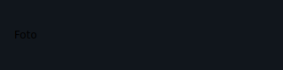

| Prop | Tipo | Padrão | Descrição |
|---|---|---|---|
| `src` | `str` | *(obrigatório)* | URL ou caminho do asset da imagem. |
| `fit` | `ImageFit` | `ImageFit.CONTAIN` | Modo de ajuste: `CONTAIN`, `COVER`, `FILL`, `NONE`. |
| `alt` | `str` | `""` | Texto alternativo para acessibilidade. |

---

## Icon

Exibe um ícone vetorial nomeado, extraído do conjunto de ícones da plataforma.

```python
from tempestroid import Icon, Row, Text

Row(
    children=[
        Icon(name="star", size=24.0, key="ico"),
        Text(content="Favorito", key="lbl"),
    ],
)
```

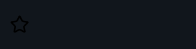

| Prop | Tipo | Padrão | Descrição |
|---|---|---|---|
| `name` | `str` | *(obrigatório)* | Nome do ícone na plataforma (ex.: `"star"`, `"home"`, `"close"`). |
| `size` | `float \| None` | `None` | Tamanho em pixels lógicos. `None` herda do tema. |

---

## Svg

Exibe um gráfico vetorial escalável (SVG) carregado de uma URL ou asset.

```python
from tempestroid import Container, Svg, Style

Container(
    style=Style(width=120.0, height=120.0),
    child=Svg(
        src="assets/logo.svg",
        fit="contain",
        key="logo",
    ),
)
```

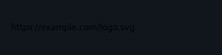

| Prop | Tipo | Padrão | Descrição |
|---|---|---|---|
| `src` | `str` | *(obrigatório)* | URL ou caminho do arquivo SVG. |
| `fit` | `ImageFit` | `ImageFit.CONTAIN` | Modo de ajuste: `CONTAIN`, `COVER`, `FILL`, `NONE`. |

---

## Canvas

Uma superfície de desenho de modo retido que interpreta uma lista de comandos
de desenho. Útil para gráficos customizados, charts e animações vetoriais.

```python
from tempestroid import Canvas
from tempestroid.widgets.media import (
    MoveTo, LineTo, StrokeCmd,
)

Canvas(
    width=200.0,
    height=100.0,
    commands=[
        MoveTo(x=0.0, y=50.0),
        LineTo(x=200.0, y=50.0),
        StrokeCmd(color="#FF0000", width=2.0),
    ],
    key="chart",
)
```

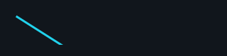

| Prop | Tipo | Padrão | Descrição |
|---|---|---|---|
| `commands` | `list[DrawCommand]` | `[]` | Sequência de comandos de desenho: `MoveTo`, `LineTo`, `ArcTo`, `Close`, `FillCmd`, `StrokeCmd`, `DrawText`, `DrawRect`, `DrawOval`. |
| `width` | `float \| None` | `None` | Largura da superfície em pixels lógicos. |
| `height` | `float \| None` | `None` | Altura da superfície em pixels lógicos. |

!!! tip "Comandos são acumulativos"
    Os comandos de `Canvas` formam um *path* retido. `MoveTo` / `LineTo` /
    `ArcTo` constroem o contorno; `FillCmd` / `StrokeCmd` pintam o contorno
    corrente; `Close` fecha o segmento. `DrawText` / `DrawRect` / `DrawOval`
    são formas autônomas que não afetam o *path* em construção.

---

## VideoPlayer

Um player de vídeo embutido que reproduz um arquivo local ou remoto.

```python
from tempestroid import VideoPlayer

VideoPlayer(
    src="https://example.com/video.mp4",
    autoplay=False,
    loop=True,
    controls=True,
    muted=False,
    key="player",
)
```

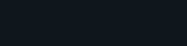

| Prop | Tipo | Padrão | Descrição |
|---|---|---|---|
| `src` | `str` | *(obrigatório)* | URL ou caminho do vídeo. |
| `autoplay` | `bool` | `False` | Inicia a reprodução automaticamente ao montar. |
| `loop` | `bool` | `False` | Repete o vídeo ao chegar ao fim. |
| `controls` | `bool` | `True` | Exibe controles nativos de play/pause/seek. |
| `muted` | `bool` | `False` | Muta o áudio (necessário para autoplay em alguns navegadores/dispositivos). |

---

## WebView

Uma janela de navegação embutida que carrega uma página web remota via URL.

```python
from tempestroid import WebView

WebView(
    url="https://docs.tempestroid.dev",
    javascript_enabled=True,
    key="docs",
)
```

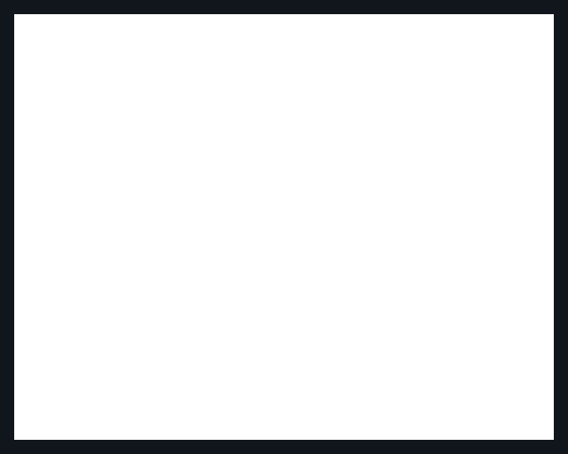

| Prop | Tipo | Padrão | Descrição |
|---|---|---|---|
| `url` | `str` | *(obrigatório)* | URL da página a carregar. |
| `javascript_enabled` | `bool` | `True` | Habilita a execução de JavaScript na página. |

---

## Blur

Embrulha um filho e aplica um desfoque gaussiano sobre ele.

```python
from tempestroid import Blur, Image

Blur(
    radius=12.0,
    child=Image(src="https://example.com/bg.jpg", key="bg"),
    key="blurred",
)
```

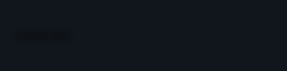

| Prop | Tipo | Padrão | Descrição |
|---|---|---|---|
| `radius` | `float` | `8.0` | Raio do desfoque em pixels lógicos. Valores maiores = mais desfoque. |
| `child` | `Widget \| None` | `None` | Filho a ser desfocado. |

---

## BackdropFilter

Embrulha um filho e aplica um desfoque gaussiano **nas camadas atrás dele**
(alias semântico de `Blur`). Ideal para efeitos de vidro fosco (*frosted glass*).

```python
from tempestroid import BackdropFilter, Container, Stack, Style, Text

Stack(
    children=[
        Container(
            style=Style(background="https://example.com/bg.jpg"),
            key="bg",
        ),
        BackdropFilter(
            radius=16.0,
            child=Container(
                style=Style(
                    background="rgba(255,255,255,0.2)",
                    padding=24.0,
                    border_radius=12.0,
                ),
                child=Text(content="Vidro fosco", key="label"),
                key="glass",
            ),
            key="backdrop",
        ),
    ],
)
```

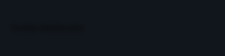

| Prop | Tipo | Padrão | Descrição |
|---|---|---|---|
| `radius` | `float` | `8.0` | Raio do desfoque nas camadas de trás. |
| `child` | `Widget \| None` | `None` | Filho exibido sobre o desfoque. |

!!! note "BackdropFilter vs Blur"
    `Blur` desfoca o **próprio filho**; `BackdropFilter` desfoca **o que está
    atrás** do filho (camadas inferiores). Semanticamente são a mesma operação
    de raio — a diferença está em qual alvo o desfoque recai.

---

## ClipPath

Recorta o filho em uma forma predefinida.

```python
from tempestroid import ClipPath, Image
from tempestroid.widgets.media import ClipShape

ClipPath(
    shape=ClipShape.CIRCLE,
    radius=0.0,
    child=Image(src="https://example.com/avatar.jpg", key="img"),
    key="clip",
)
```

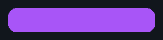

| Prop | Tipo | Padrão | Descrição |
|---|---|---|---|
| `shape` | `ClipShape` | `ClipShape.ROUNDED_RECT` | Forma do recorte: `ROUNDED_RECT`, `CIRCLE`, `OVAL`. |
| `radius` | `float` | `8.0` | Raio dos cantos para `ROUNDED_RECT`. Ignorado para `CIRCLE` / `OVAL`. |
| `child` | `Widget \| None` | `None` | Filho a ser recortado. |

---

## CameraPreview

**(Exclusivo do dispositivo)** — Superfície de câmera ao vivo, renderizada pelo
hardware. Exibe um placeholder sinalizado no simulador Qt.

```python
from tempestroid import CameraPreview

CameraPreview(
    facing="back",
    key="cam",
)
```

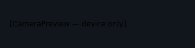

| Prop | Tipo | Padrão | Descrição |
|---|---|---|---|
| `facing` | `str` | `"back"` | Câmera a usar: `"back"` (traseira) ou `"front"` (frontal). |

!!! warning "Somente no dispositivo"
    `CameraPreview` requer acesso à câmera do hardware Android. No simulador Qt
    ele aparece como um **placeholder sinalizado** — nenhuma câmera real é
    acessada no desktop.

---

## QrScanner

**(Exclusivo do dispositivo)** — Superfície de câmera que lê QR codes e
códigos de barras em tempo real, reportando cada leitura via `on_scan`. Exibe
um placeholder sinalizado no simulador Qt.

```python
from tempestroid import QrScanner, QrScanEvent, Text

async def on_code(e: QrScanEvent) -> None:
    app.set_state(lambda s: setattr(s, "last_code", e.value))

QrScanner(
    on_scan=on_code,
    key="scanner",
)
```

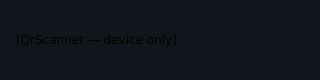

| Prop | Tipo | Padrão | Descrição |
|---|---|---|---|
| `on_scan` | `handler → QrScanEvent` | `None` | Chamado a cada código detectado. O handler recebe um `QrScanEvent` com o campo `value` (string do código). |

!!! warning "Somente no dispositivo"
    `QrScanner` requer a câmera do hardware Android. No simulador Qt ele
    aparece como um **placeholder sinalizado** — nenhum código é lido no
    desktop.

---

## MapView

**(Exclusivo do dispositivo)** — Mapa interativo centrado em uma coordenada,
com suporte a marcadores. Exibe um placeholder sinalizado no simulador Qt.

```python
from tempestroid import MapView

MapView(
    latitude=-15.7801,
    longitude=-47.9292,
    zoom=14.0,
    markers=[
        {"lat": -15.7801, "lon": -47.9292, "title": "Brasília"},
    ],
    key="map",
)
```

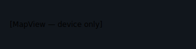

| Prop | Tipo | Padrão | Descrição |
|---|---|---|---|
| `latitude` | `float` | `0.0` | Latitude do centro do mapa em graus decimais. |
| `longitude` | `float` | `0.0` | Longitude do centro do mapa em graus decimais. |
| `zoom` | `float` | `12.0` | Nível de zoom (valores típicos: 1–20). |
| `markers` | `list[dict[str, Any]]` | `[]` | Lista de marcadores; cada dict deve ter `"lat"`, `"lon"` e opcionalmente `"title"`. |

!!! warning "Somente no dispositivo"
    `MapView` depende de APIs de mapa do Android (Google Maps ou equivalente).
    No simulador Qt ele aparece como um **placeholder sinalizado** — nenhum
    mapa real é carregado no desktop.

---

## Recapitulando

- **`Image` / `Icon`** — primitivas de rasterizado e vetorial nomeado; ambas
  funcionam nos dois renderizadores.
- **`Svg`** — gráfico vetorial escalável a partir de URL ou asset.
- **`Canvas`** — superfície de desenho programático via lista de comandos;
  ideal para charts e gráficos customizados.
- **`VideoPlayer` / `WebView`** — conteúdo embutido (vídeo e página web);
  funcionam nos dois renderizadores.
- **`Blur` / `BackdropFilter`** — efeitos de desfoque sobre o próprio filho ou
  sobre as camadas de trás; `radius` controla a intensidade.
- **`ClipPath`** — recorta o filho em `ROUNDED_RECT`, `CIRCLE` ou `OVAL`.
- **`CameraPreview` / `QrScanner` / `MapView`** — exclusivos do dispositivo
  Android (Compose); aparecem como placeholder no Qt.

Próximos passos: estilize os widgets com **[Estilos](../estilos.md)**, explore
efeitos de animação nos widgets de **[Animação](animation.md)**, ou veja apps
completos na **[Galeria de exemplos](../exemplos.md)**.
