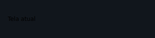
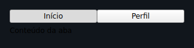
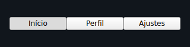
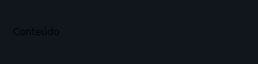

# Navegação

Um app móvel tem mais de uma tela. O tempestroid modela isso com uma **pilha de
rotas** mantida pelo `App`: a função `view` lê `app.nav.top` para decidir qual
árvore de widgets construir, então trocar de tela é apenas o `view` produzindo
uma árvore diferente — o reconciliador já sabe fazer o diff. Nenhum tipo de patch
novo é introduzido. O botão Voltar do Android (ou `Esc` no simulador Qt) chama
`app.pop` automaticamente.

!!! info "Importe sempre do nível do pacote"
    ```python
    from tempestroid import Navigator, TabBar, TabView, RouteDrawer, Route
    ```

---

## Navigator

Host de pilha de navegação: renderiza a tela no topo da pilha e aplica uma
animação de transição ao trocar de rota.

```python
from dataclasses import dataclass

from tempestroid import (
    Button,
    Column,
    Navigator,
    Route,
    Style,
    Text,
)
from tempestroid.core.state import App


@dataclass
class State:
    pass


def home_screen(app: App[State]) -> Navigator:
    """Tela inicial com botão que navega para detalhes."""

    def go_details() -> None:
        app.push(Route(name="/details", params={"id": 42}))

    return Navigator(
        transition="slide",
        depth=len(app.nav.stack),
        child=Column(
            children=[
                Text(content="Início", key="title"),
                Button(label="Ver detalhes", on_click=go_details, key="btn"),
            ],
        ),
    )


def details_screen(app: App[State]) -> Navigator:
    """Tela de detalhes com botão de voltar."""

    def go_back() -> None:
        app.pop()

    item_id = app.nav.top.params.get("id")
    return Navigator(
        transition="slide",
        depth=len(app.nav.stack),
        child=Column(
            children=[
                Text(content=f"Detalhes do item {item_id}", key="title"),
                Button(label="Voltar", on_click=go_back, key="back"),
            ],
        ),
    )


def view(app: App[State]) -> Navigator:
    """Escolhe a tela com base na rota no topo da pilha."""
    if app.nav.top.name == "/details":
        return details_screen(app)
    return home_screen(app)
```



### Props

| Prop | Tipo | Padrão | Descrição |
|---|---|---|---|
| `child` | `Widget` | — _(obrigatório)_ | A árvore de widgets da tela atual. |
| `transition` | `str` | `"slide"` | Dica de animação de transição para os renderizadores: `"slide"`, `"fade"` ou `"none"`. |
| `depth` | `int` | `0` | Profundidade atual da pilha; os renderizadores usam esse valor para inferir a direção da animação (avançar vs. voltar). |

!!! tip "Transições são uma dica, não um contrato"
    `transition` e `depth` informam os renderizadores sobre *como* animar a troca
    de tela, mas não fazem parte do diff de conteúdo. O Qt anima com
    `QPropertyAnimation`; o Compose usa `AnimatedContent`. Defina `"none"` para
    desativar a animação.

---

## TabView

Host com abas: exibe uma barra de abas e o conteúdo da aba ativa. A prop `active`
controla qual aba está selecionada; `on_change` é chamado quando o usuário toca
em outra aba.

```python
from dataclasses import dataclass

from tempestroid import (
    Column,
    RouteChangeEvent,
    TabView,
    Text,
)
from tempestroid.core.state import App


@dataclass
class State:
    tab: int = 0


def view(app: App[State]) -> TabView:
    """Aplicativo de três abas."""

    def on_tab_change(event: RouteChangeEvent) -> None:
        app.set_state(lambda s: setattr(s, "tab", event.params["index"]))

    screens = [
        Column(children=[Text(content="Página Início", key="h")], key="home"),
        Column(children=[Text(content="Página Busca", key="s")], key="search"),
        Column(children=[Text(content="Página Perfil", key="p")], key="profile"),
    ]

    return TabView(
        tabs=["Início", "Busca", "Perfil"],
        active=app.state.tab,
        child=screens[app.state.tab],
        on_change=on_tab_change,
    )
```



### Props

| Prop | Tipo | Padrão | Descrição |
|---|---|---|---|
| `tabs` | `list[str]` | — _(obrigatório)_ | Rótulos das abas, na ordem em que aparecem. |
| `active` | `int` | `0` | Índice da aba ativa (base zero). |
| `child` | `Widget` | — _(obrigatório)_ | Conteúdo da aba ativa. |
| `on_change` | handler → `RouteChangeEvent` | `None` | Chamado quando o usuário seleciona outra aba. O índice da nova aba está em `event.params["index"]`. |

---

## TabBar

Barra de abas autônoma: só a faixa de rótulos selecionáveis, sem gerenciar
conteúdo. Use quando precisar de controle total sobre o layout — por exemplo,
dentro de um `Scaffold` ou acima de um `Navigator`.

```python
from dataclasses import dataclass

from tempestroid import (
    Column,
    RouteChangeEvent,
    TabBar,
    Text,
)
from tempestroid.core.state import App


@dataclass
class State:
    tab: int = 0


def view(app: App[State]) -> Column:
    """TabBar separada do conteúdo."""

    def on_tab_change(event: RouteChangeEvent) -> None:
        app.set_state(lambda s: setattr(s, "tab", event.params["index"]))

    content = [
        Text(content="Conteúdo da aba A", key="a"),
        Text(content="Conteúdo da aba B", key="b"),
        Text(content="Conteúdo da aba C", key="c"),
    ][app.state.tab]

    return Column(
        children=[
            TabBar(
                tabs=["Aba A", "Aba B", "Aba C"],
                active=app.state.tab,
                on_change=on_tab_change,
                key="bar",
            ),
            content,
        ],
    )
```



### Props

| Prop | Tipo | Padrão | Descrição |
|---|---|---|---|
| `tabs` | `list[str]` | — _(obrigatório)_ | Rótulos das abas. |
| `active` | `int` | `0` | Índice da aba selecionada (base zero). |
| `on_change` | handler → `RouteChangeEvent` | `None` | Chamado ao selecionar uma aba. O índice está em `event.params["index"]`. |

!!! note "TabBar vs. TabView"
    `TabBar` emite o mesmo `RouteChangeEvent` com `params["index"]` que `TabView`
    — a diferença é apenas estrutural: `TabView` também renderiza o conteúdo
    integrado, enquanto `TabBar` é uma faixa avulsa que você posiciona livremente.

---

## RouteDrawer

Host com gaveta lateral: conteúdo principal com um painel deslizante sobreposto.
`open` controla se a gaveta está visível; `on_change` é emitido quando o usuário
fecha a gaveta deslizando ou tocando fora dela.

```python
from dataclasses import dataclass

from tempestroid import (
    Button,
    Column,
    RouteChangeEvent,
    RouteDrawer,
    Text,
)
from tempestroid.core.state import App


@dataclass
class State:
    drawer_open: bool = False


def view(app: App[State]) -> RouteDrawer:
    """Tela principal com gaveta de navegação lateral."""

    def open_drawer() -> None:
        app.set_state(lambda s: setattr(s, "drawer_open", True))

    def on_drawer_change(event: RouteChangeEvent) -> None:
        # O renderizador emite este evento ao fechar a gaveta por gesto/toque externo.
        app.set_state(lambda s: setattr(s, "drawer_open", False))

    drawer_content = Column(
        children=[
            Text(content="Menu", key="title"),
            Button(label="Início", on_click=lambda: None, key="home"),
            Button(label="Configurações", on_click=lambda: None, key="settings"),
        ],
    )

    main_content = Column(
        children=[
            Text(content="Conteúdo principal", key="main"),
            Button(label="Abrir menu", on_click=open_drawer, key="open"),
        ],
    )

    return RouteDrawer(
        child=main_content,
        drawer=drawer_content,
        open=app.state.drawer_open,
        on_change=on_drawer_change,
    )
```



### Props

| Prop | Tipo | Padrão | Descrição |
|---|---|---|---|
| `child` | `Widget` | — _(obrigatório)_ | Conteúdo principal (sempre visível). |
| `drawer` | `Widget` | — _(obrigatório)_ | Conteúdo do painel lateral deslizante. |
| `open` | `bool` | `False` | Se `True`, a gaveta está aberta e visível. |
| `on_change` | handler → `RouteChangeEvent` | `None` | Chamado quando a gaveta é fechada por interação do usuário (gesto de deslizar ou toque fora). |

---

## Recapitulando

- A navegação não é um tipo de patch novo — é apenas o `view` lendo
  `app.nav.top` e retornando uma árvore diferente para cada rota.
- Use `app.push(Route(name="..."))` para avançar, `app.pop()` para voltar,
  `app.replace(...)` para substituir a rota atual sem mudar a profundidade da
  pilha, e `app.reset([...])` para redefinir toda a pilha (por exemplo, num
  *deep link*).
- `Navigator` renderiza a tela atual com animação de transição; `TabView` e
  `TabBar` gerenciam abas; `RouteDrawer` oferece uma gaveta lateral como rota.
- `TabView` e `TabBar` emitem `RouteChangeEvent` com `params["index"]` ao trocar
  de aba.
- Os dois renderizadores suportam todos esses widgets. O botão Voltar do Android
  mapeia para `app.pop`; o `Esc` no simulador Qt faz o mesmo.

## Próximos passos

➡️ Aprenda sobre **[Overlays](overlays.md)** para diálogos e menus, ou
consulte os **[Eventos](../eventos.md)** tipados para entender o `RouteChangeEvent`
em detalhes.
